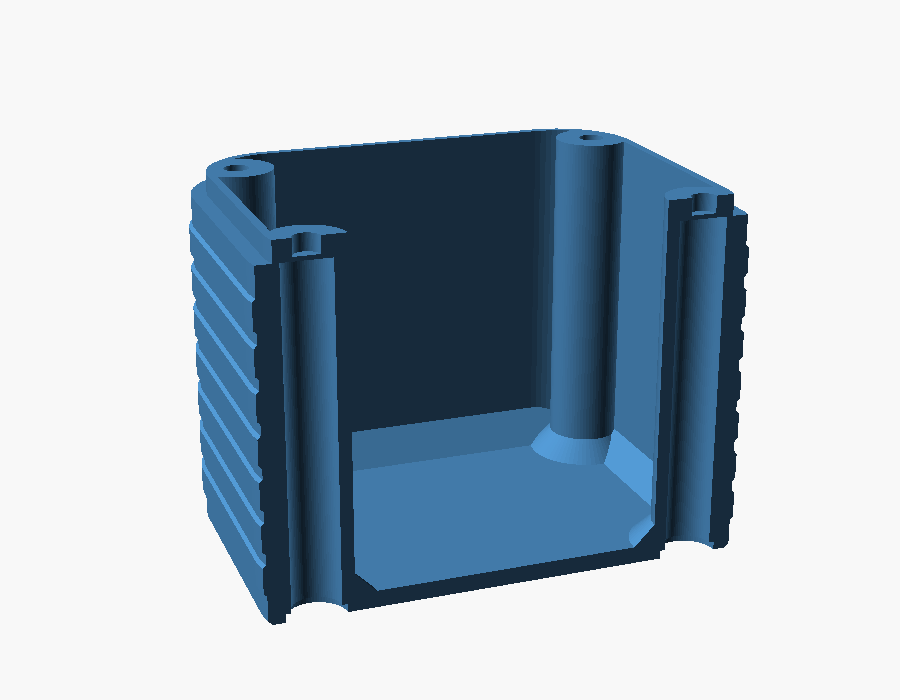
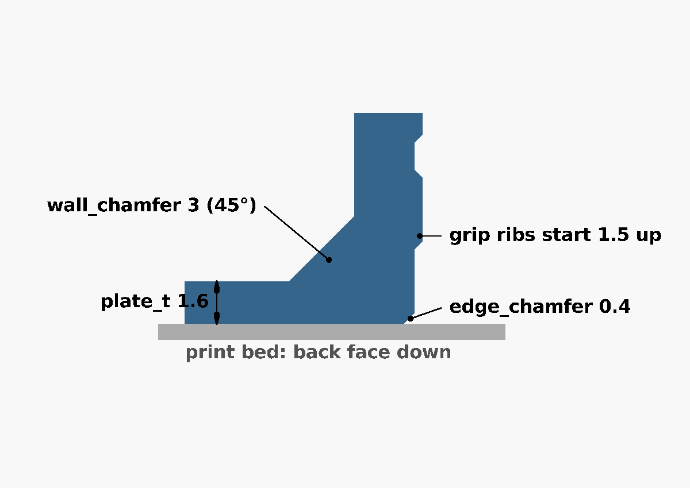
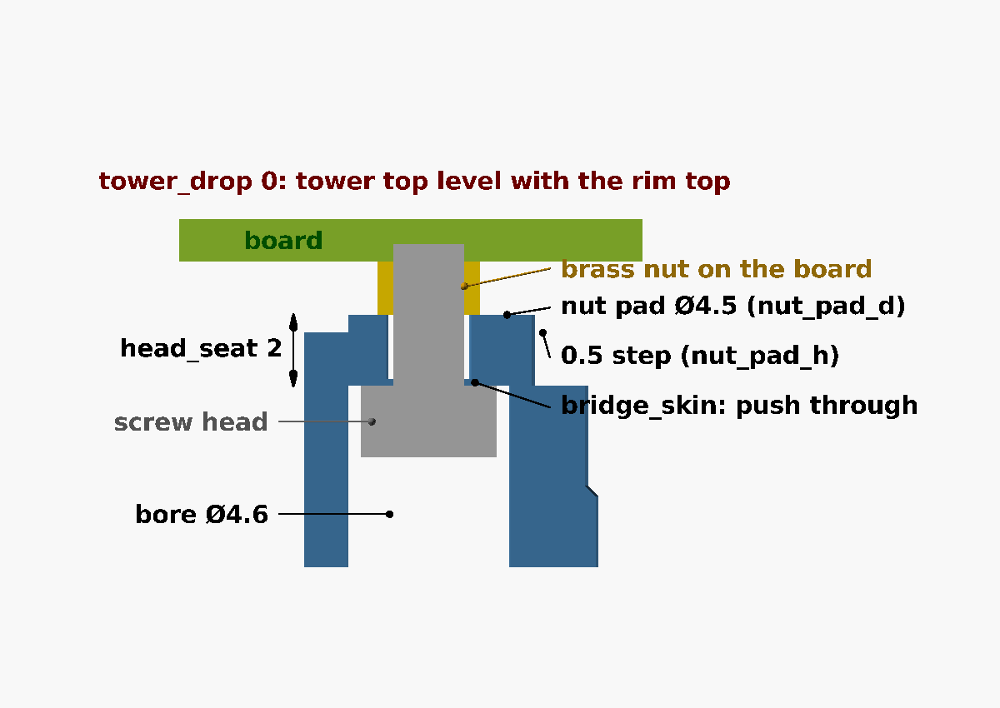
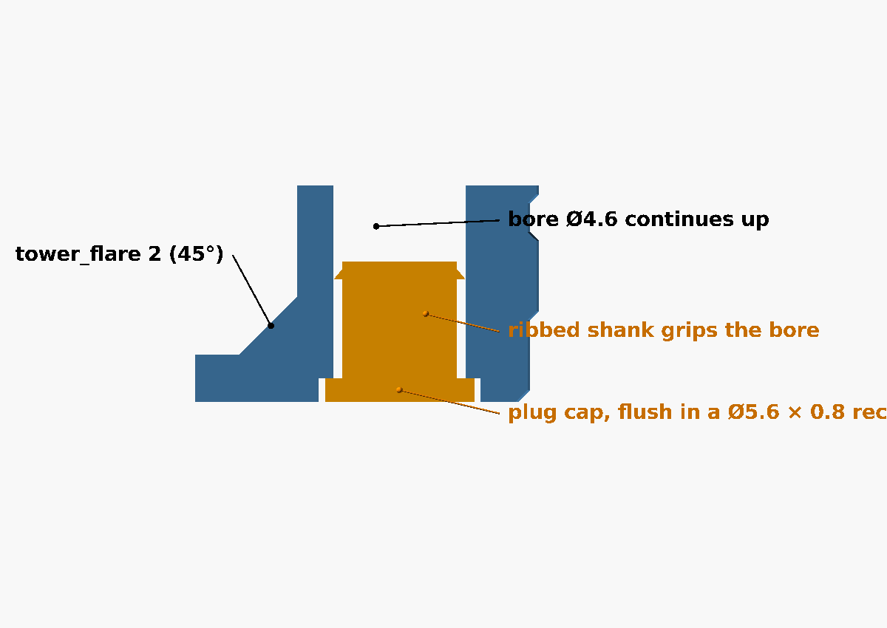
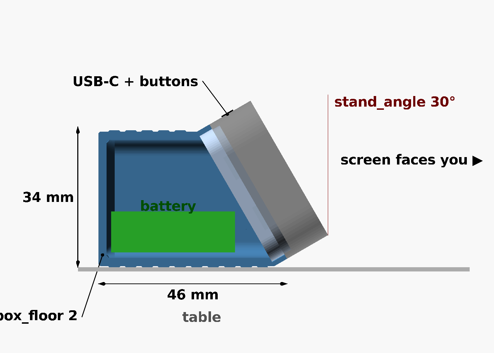
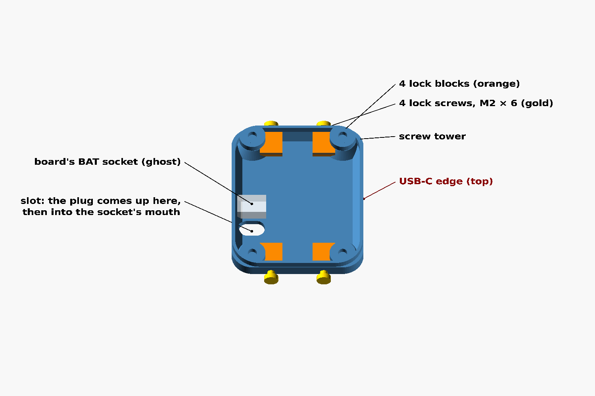
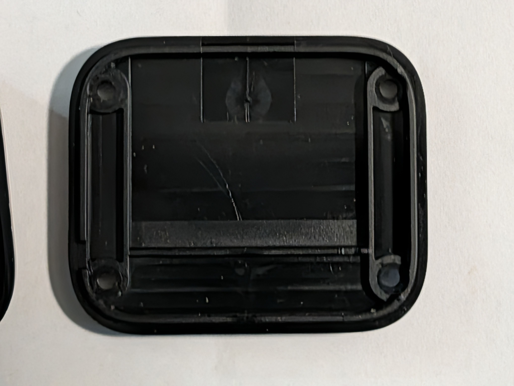
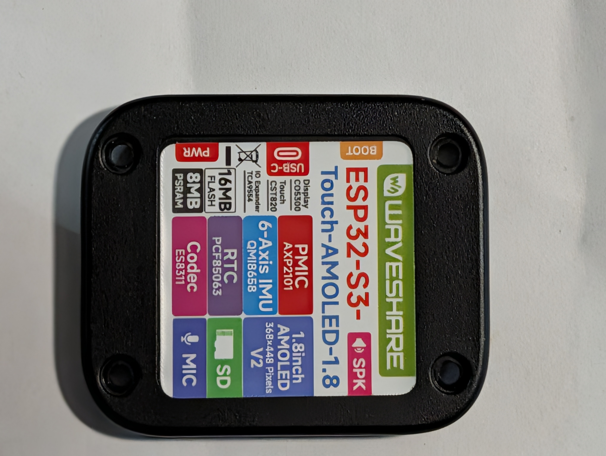
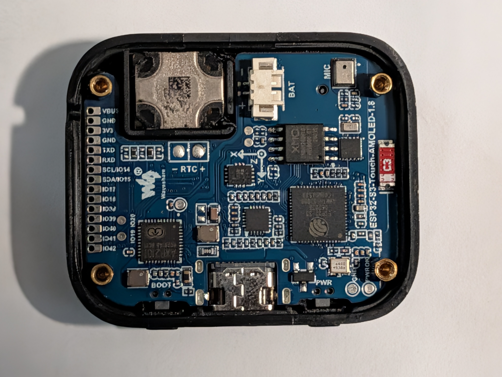

# Design notes

> **Status:** Living · **Last verified:** 2026-09-23

How the plate is built, why, and where every number came from. You don't need this to print or
adjust it. Back to the [README](README.md).

## Battery cavity

The plate is a box with straight walls. The whole inside is open apart from four screw towers,
and its depth follows the battery. The cell sits on tape with foam on top, and the cavity is
deliberately not shaped to the cell: gaps are packed with foam. All ports, buttons and the mic
are in the front shell, so the plate has no other openings.

- **Orientation.** The screws pass through 24 mm apart across the case, so a wide cell can't lie
  flat past them. On its **edge** a cell is only its thickness wide there; on its **end** its
  length becomes the plate's depth, so any length fits.
- **Wire room.** A pouch cell's wires leave one end. `lead_end` (2 mm) keeps that free; the
  default still has 1.85 mm spare at each end beyond it. A 40 mm cell such as an 852540 doesn't
  fit flat or on its edge once its wires have room.
- **Clearances.** The console warns `TIGHT` when anything comes within 0.5 mm of the cell and
  refuses to export under 0.2 mm, because real cells run up to half a millimetre over.
- **Bracing.** A 45° chamfer where the walls meet the floor (`wall_chamfer`, 3 mm) and a 45°
  flare where each tower meets it (`tower_flare`, 2 mm). Both shrink near the cell to stay
  0.5 mm off its bottom edge, so they never lift it.
- **The board's `BAT` connector** stands 3.5 mm off the back of the board, on one long side about
  halfway along. The flat 802525 sits under it, so that version leaves 2 mm extra above the cell.
- **The rim** is the top of the wall itself (0.8 mm), so it stands squarely on the wall with
  nothing overhanging. Its opening is the cavity.

## Screws

The brass nuts the screws thread into are soldered to the **board**, not the case. On the stock
cover a post around each screw presses its nut, so tightening clamps the board. This plate does
the same with four hollow towers:

- The bore (Ø4.6) takes the screw head and hex key up to the **seat**, 2 mm of plastic at the top
  (`head_seat`). The screw only passes through the seat into the nut, so short screws work at
  any plate height.
- The tower top is flat and full width (Ø7), level with the rim, and presses squarely on the
  nut. If it ever needs to stand clear of parts near a nut (Waveshare's 3D model has small ones
  about 3 mm from some), `nut_pad_h` raises a Ø4.5 pad around the nut instead.
- A thin skin (`bridge_skin`, 0.4 mm — two layers) closes each bore so the printer can bridge it;
  it's cleared at assembly.

**Screw length.** Push a stock screw through the stock cover and measure how far it sticks out
past its post — that's how far it goes into the nut. Length = 2 mm (seat) + that, rounded
**down** to a size that's sold. The display sits right against the front of the board, so never
exceed 2 mm + nut height + 1.2 mm (the board) − 0.5 mm. Without a stock screw to measure, use
M2 × 4; M2 × 5 only if the nuts are at least 2 mm tall.

## Hole plugs

A shallow recess (Ø5.6 × 0.8) at each tower opening, and plugs with a thin cap and a ribbed
shank: six ribs that crush slightly going in, for a press fit with no glue. A small gap around
each cap lets a knife tip pry it out. They're a choking hazard for babies.

## Grip

Horizontal ribs right round the outside, corners included: bands 3 mm tall, 0.3 mm proud by
default (`grip_depth`, 0–0.5), with 45° slopes top and bottom so they print without supports.
They stop 1.5 mm short of the bed edge and the seam.

## The tall 104050 version

A 104050 (10 × 40 × 50 mm, sold as 2400 mAh; expect about 2000) standing on its 10 × 40 face,
wires at the top, about 67 mm tall overall. Its 40 mm width sits in a 40.7 mm opening — 0.35 mm
per end, hence "measure first"; set `lip_wall` to 0.6 for 41.1 mm if it's over. The common
listing ships a JST PH 2.0 plug that needs swapping for 1.25 mm. The screws are the same M2 × 4;
the hex driver needs a 60 mm shaft.

## The desk stand

Two parts, so the box stays a plain box and the part that meets the display stays the stock
cover's shape:

- **The head** is the plate at stock depth (5.5 mm) with no battery room: same rim, same four
  towers, so it fits the front shell exactly as the stock cover does. It is smaller than the case
  by the box's rim wall, with tighter corners (R5.55) so the wall outside each screw bore stays 1
  mm thick. It adds a solid block for each lock screw inside its short ends (left and right in
  use), and a slot through the floor just in front of the board's `BAT` socket, whose mouth faces
  the slot (from Waveshare's 3D model). The socket is on the side away from the USB-C, which fixes
  which way round the head goes. Its back edge has no chamfer, so all of it bears on the ledge,
  and its tower flares don't change with the battery, so one head fits every box.
- **The box** is a straight-walled prism, printed standing on its floor. Its open end is cut at
  `stand_angle`, and the head sinks into it: its back rests on a ledge `stand_ledge` wide inside,
  and round it the box's wall carries on `pocket_wall` thick to the seam, where the front shell
  sits on it. The outside of that band is the case outline, so box and front shell are flush;
  the head's rim stands above the seam into the front shell as usual. Below the ledge the box is
  open under the head, so the head's back is its lid. Where its walls meet the floor there's a
  45° chamfer, kept under the tape beside the cell as on the plate.
- **How it sits.** In use the box lies on its long flat wall, with the cut end facing you, so the
  screen leans back `stand_angle` from upright. The display goes in with its USB-C edge (the
  head's +x, where the two buttons are too) to the box's short wall, which puts it along the top.
  Nothing of the box stands past the seam, so the USB-C plug and the buttons are clear. Lying on
  a side 45 mm wide and as long as the box, it's low and steady.
- **Box size.** The cell lies on that long flat wall, as far along it as its corners allow 0.5 mm
  from the rounded corners. The box is then made just long enough that the head clears the top of
  the cell (in the print frame) plus tape, foam, wires and `extra_clearance`, but its short wall
  is never shorter than `stand_front_min`. The box is modelled in its print frame; `part = stand`
  shows it lying as it's used (`stand_pose()` in the `.scad`).
- **Printing.** Standing on its floor, the box's walls are vertical and its cut end slopes at
  `stand_angle`, so it prints with no supports; the band's walls lean at that angle too, the
  same as the front shell's. The band is 1.1 mm at the sides and about 1.3 mm along the long and
  short walls.
- **Screws.** Four M2 × 4 hold the display to the head, exactly as on the plate (the towers are
  3.5 mm deep). The four M2 × 6 lock screws, two at each side `lock_spread` (14 mm) apart, pass
  through the box's band 1 mm up from the ledge, so the hole's lower edge runs into the solid wall
  below, and cut their own thread about 4.7 mm into the head's lock blocks; the holes are deep
  enough for an M2 × 8.

## Where the numbers come from

Sources: Waveshare's [dimension drawing](https://docs.waveshare.com/ESP32-S3-Touch-AMOLED-1.8) and
[3D
model](https://files.waveshare.com/wiki/ESP32-S3-Touch-AMOLED-1.8/ESP32-S3-Touch-AMOLED-1.8-3D.zip)
([resources page](https://docs.waveshare.com/ESP32-S3-Touch-AMOLED-1.8/Resources-And-Documents)),
and the photos in `photos/`. Copies are kept in [`reference/`](reference/README.md), with
`reference/measure.py` to re-derive them. The 3D model has the board and display but not the case.

| Default | Value | Source | Confidence |
|---|---|---|---|
| `plate_x` × `plate_y` | 37.6 × 45.2 | Case outline, dimension drawing | High (official) |
| `screw_dx`, `screw_dy` | 12.0, 18.0 (24 × 36 apart) | PCB mounting holes in the 3D model; drawing and photos agree within ~0.7 mm | High |
| `plate_r` | 8.7 | Circle fitted to the drawing's corners | Good, ±0.5 |
| `lip_outer_x` × `lip_outer_y`, `lip_outer_r` | 35.0 × 42.6, 7.4 | Outline minus a ~1.3 mm front-shell wall, from the photos (the board is 33.0 × 40.6) | Estimate: measure |
| `lip_h` | 2.0 | Not visible in any source | Guess: measure |
| `stock_clear` | 3.9 | Stock cover shows 3.5 mm in the side view; derived with the rim height | Estimate |
| `tower_drop` | 0 | Where the stock posts stop isn't visible | Guess: measure |
| `lip_wall` | 0.8 | Chosen: the rim's inside is the cavity; 0.8 leaves a 40.7 mm opening | Design choice |
| `screw_size` | M2 | Heads ~3.8 mm across in the drawing (stock ones are Phillips) | Likely |
| Tower bore | Ø4.6 | ISO 4762 M2 head (Ø3.8) + `head_clear` 0.6 + `hole_slop` 0.2 | Standard |

For reference: the stock unit is 15.0 mm thick; Waveshare's largest recommended cell for the
stock case is 3.85 × 24 × 28 mm; the stock back label window is 27.6 × 27.6 mm, R1.8.

## Regenerating the images

Every image in these guides is rendered from the model: `renders/make_renders.sh` rebuilds them
all (OpenSCAD 2021+; on a headless machine it uses `xvfb-run`). The figure sources are in
`renders/src/`; the labelled ones draw their dimension lines and text in OpenSCAD itself
(`renders/src/annot.scad`), so a change to the model only needs a re-run.

## Photos of the real unit

| Stock cover, inside | Assembled back | Board in the front shell |
|---|---|---|
|  |  |  |
