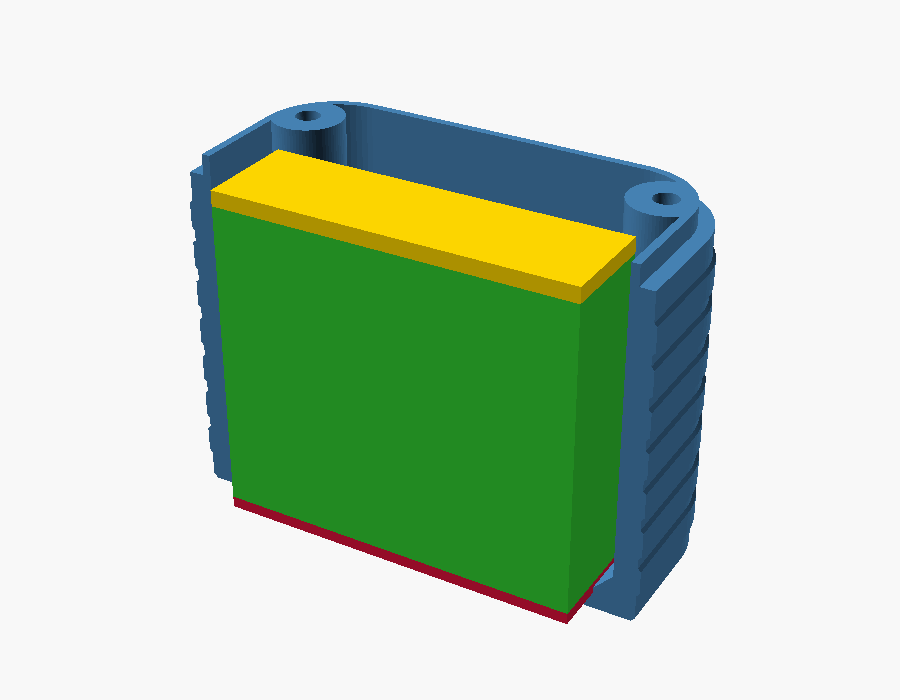
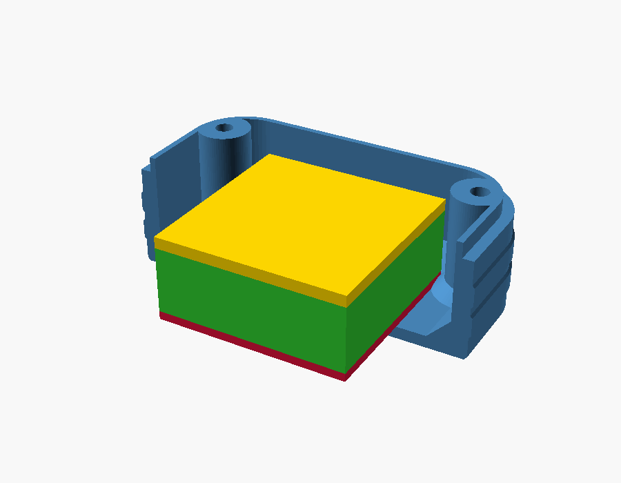
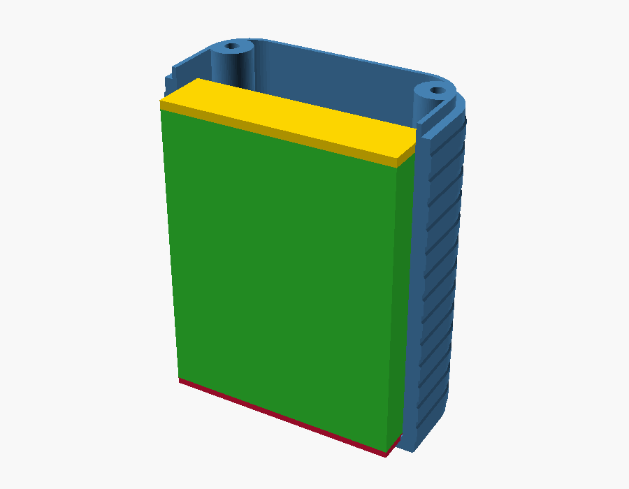
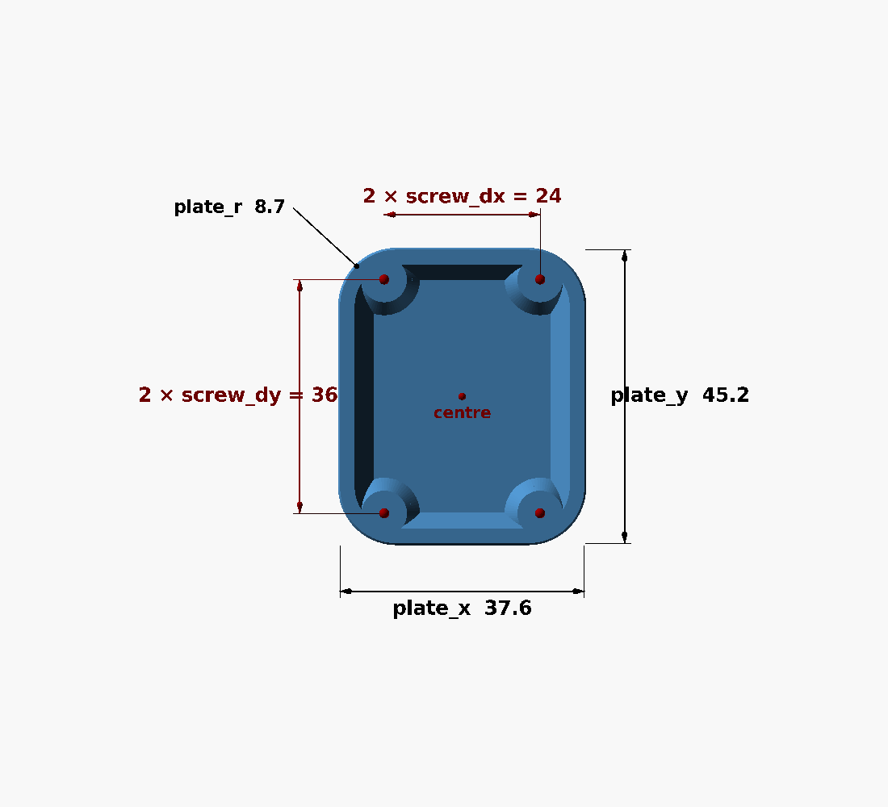
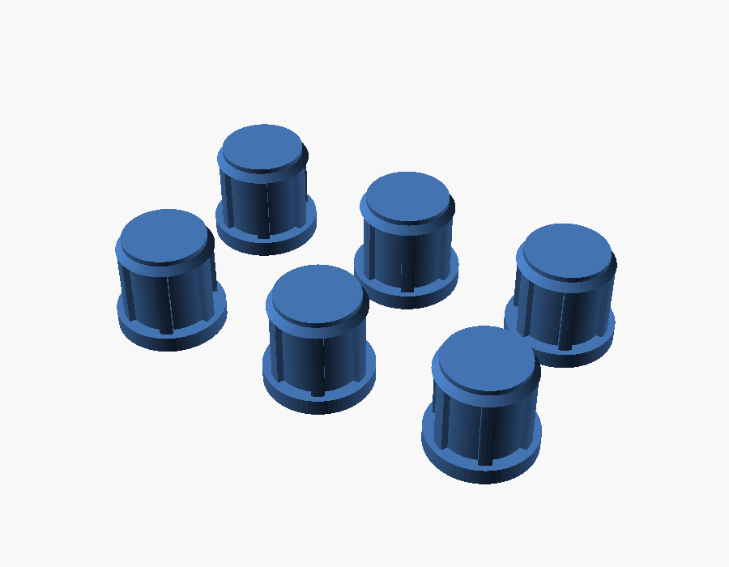
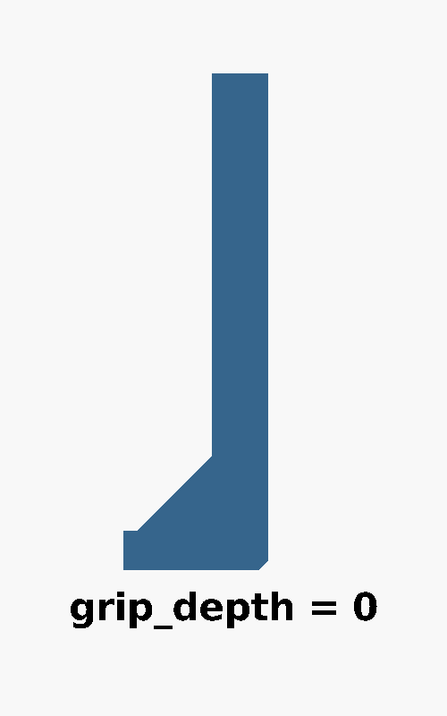
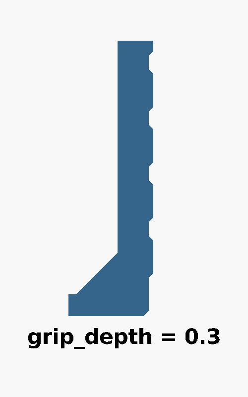
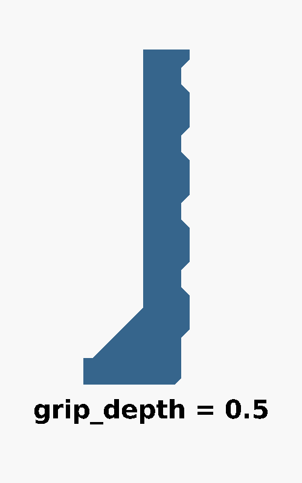

# Adjusting the model

> **Status:** Living · **Last verified:** 2026-09-23

How to change the plate: another battery, a better fit to the case, a different grip. You never
edit code — every number is a labelled field in a form. Back to the [README](README.md).

## Opening it (first time)

1. Install [OpenSCAD](https://openscad.org/downloads.html) (free, Windows/Mac/Linux).
2. Download `amoled18_back_plate.scad` **and** `amoled18_back_plate.json` into the same folder
   (on GitHub: click the file, then the download icon). The `.json` holds the ready-made versions.
3. Open the `.scad`. Turn on the form: **Window → Customizer** (on some versions untick **View →
   Hide customizer**). Press **F5** to see the part; drag to spin, scroll to zoom.
4. **Start from a version**: the drop-down at the top of the Customizer has all three. Then
   change fields — the groups are numbered, and each field has a plain-English label.
5. **Read the console** at the bottom (**Window → Console** if hidden) after each **F5**:
   - `All checks passed.` — good to go.
   - `TIGHT: only … mm spare` — it fits, but with under 0.5 mm to spare. Measure your real cell.
   - `CELL DOES NOT FIT` — OpenSCAD will refuse to export until you fix it.
   It also prints the cavity size, the room around the cell, the total height and how far the hex
   key has to reach.
6. **Export**: **F6** (full render, can take a minute), then **F7** to save an `.stl`.
7. **Save your numbers**: click **+** on the preset bar and name them, or they're gone when you
   close the file.

## Quick reference

| You want to… | Change | Group |
|---|---|---|
| Use a different battery | `battery_t`, `battery_w`, `battery_l` | 1. Battery |
| Stand it up, lay it flat, stand it on end | `battery_orientation` | 1. Battery |
| Different tape or foam | `tape_t`, `foam_t` | 1. Battery |
| More room for the wires | `lead_end`, `lead_space` | 1. Battery |
| Match the case's outline | `plate_x`, `plate_y`, `plate_r` | 2. Plate outline |
| Rim fit in the front shell | `lip_outer_x`, `lip_outer_y`, `lip_h`, `lip_slop`, `lip_wall` | 3. Rim |
| Screw positions | `screw_dx`, `screw_dy` | 4. Screws |
| Tower height (how hard it presses the board) | `tower_drop` | 4. Screws |
| Holes too tight or loose on your printer | `hole_slop` | 4. Screws |
| Plug fit, or no plug recesses | `plug_interference`, `plug_recess` | 4c. Hole plugs |
| Grip ribs | `grip_depth`, `grip_style` | 5b. Grip |
| Export plugs instead of the plate | `part` | 6. Output |
| See the battery in the preview | `show_battery` | 6. Output |

The sections below show what each of these is on the part.

## Battery

A cell's size code reads thickness, width, length: **103035** is 10 × 30 × 35 mm. Enter the
**real** size if you can measure it, including the little circuit board folded over at the wire
end — cheap cells often run half a millimetre over their listing.

`battery_orientation` sets how it sits:

| **edge** — on its long edge | **flat** — on its face | **end** — upright on its end |
|---|---|---|
|  |  |  |
| For cells up to about 37 mm long | For small square cells | Any length: the plate grows taller |

Why not just lay a long cell flat? The screws pass through 24 mm apart across the case, so a
wide cell would sit on them. Standing it up makes it only as wide as it is thick.

| Field | What it does |
|---|---|
| `tape_t` | Thickness of the VHB tape under the cell (1 mm tape measures about 1.1) |
| `foam_t` | Foam on top of the cell |
| `lead_end` | Room kept free past the wire end of a flat or edge cell (orange above) |
| `lead_space` | Room above the cell for wires and plug — used for a cell on its end, whose wires come out the top |
| `extra_clearance` | A little air so nothing is squeezed |

The plate's depth follows from all of these automatically.

## Outline and screw positions

These come from Waveshare's own drawings and should already be right.

| Field | What it is | How to measure it on the stock cover |
|---|---|---|
| `plate_x`, `plate_y` | Outside width and length | Straight across |
| `plate_r` | Corner radius | Roughly how round the corners are |
| `screw_dx`, `screw_dy` | Centre to screw-hole centre, across and along | Hole to hole, then halve |

## Rim

The rim is the band on top of the wall that slides into the front shell. Its size is an
estimate from photos, so it's the thing most worth checking against the stock cover.

| Field | What it is | Change it when |
|---|---|---|
| `lip_outer_x`, `lip_outer_y` | Outside size of the rim | Measure the stock rim's outside |
| `lip_h` | How tall the rim stands | Measure the stock rim |
| `lip_slop` | Taken off the outside so it isn't a press fit | Bigger = looser |
| `lip_wall` | Thickness of the rim | Thinner gives the battery a little more room (0.6 opens a 40 mm cell's space to 41.1) |

## Screw towers

Each screw goes up a hollow tower from the back. Its head sits under a 2 mm **seat** at the top,
and the tower's flat top presses on the board's brass nut.

| Field | What it is | Change it when |
|---|---|---|
| `tower_drop` | How far below the rim top the towers stop (negative = above) | Measure the stock cover: rim top to the tops of its screw posts |
| `head_seat` | Plastic between screw head and nut | Rarely; it sets the screw length (2 + how far the screw goes into the nut) |
| `nut_pad_h`, `nut_pad_d` | Optional raised pad around the nut (0 = flat top, the default) | Only if the tower top would press on parts beside a nut |
| `hole_slop` | Extra on every hole, since printers make holes small | Screw head or hex key tight in the tower: raise by 0.1 |
| `bridge_skin` | The thin skin closing each tower for printing (0.4 mm, two layers) | Thicker if it sags; 0 for none (then a small overhang instead) |

## Hole plugs

| Field | What it does |
|---|---|
| `plug_interference` | How tight the press fit is: raise if they fall out, lower if they won't go in (steps of 0.05) |
| `plug_recess` | Untick for a plain back with no recesses (and no plugs) |
| `plug_cap_gap` | The gap around each cap for prying it out |
| `plug_count` | How many to print |

To export just the plugs, set `part` (group 6) to `plugs`; `both` shows them beside the plate.

## Grip ribs

| `grip_depth = 0` | `grip_depth = 0.3` (default) | `grip_depth = 0.5` |
|---|---|---|
|  |  |  |

`grip_depth` is how far the ribs stand out, 0 to 0.5 mm (0 = smooth walls). `grip_style` also
offers `honeycomb` (raised hexagons) and `nubs` (raised squares). `grip_size`, `grip_gap` and
`grip_margin` set the rib height, spacing and how far they stay from the bed and the seam.

## Measuring the stock cover

The outline and screw positions are from Waveshare's data. These few couldn't be seen in any
source; measuring them on the original black cover makes a keeper fit first time.

| Measure | Put it in |
|---|---|
| How tall the rim stands | `lip_h` |
| The rim's outside width and length | `lip_outer_x`, `lip_outer_y` |
| Rim top down to the tops of the screw posts (0 if level, negative if the posts are higher) | `tower_drop` |
| Rim top down to the floor inside | `stock_clear` (only affects reported numbers) |
| How far a stock screw sticks out past its post, and how tall the brass nuts stand | Choosing screw length — [DESIGN.md](DESIGN.md#screws) |
