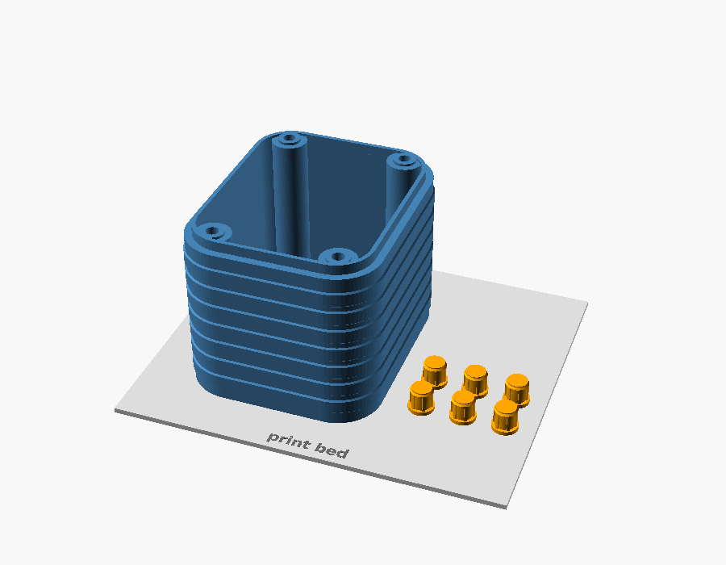
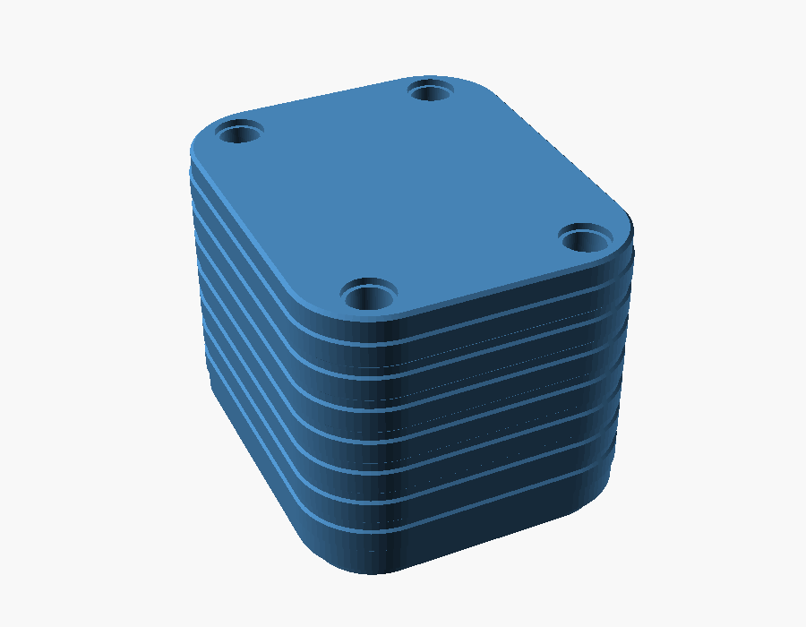
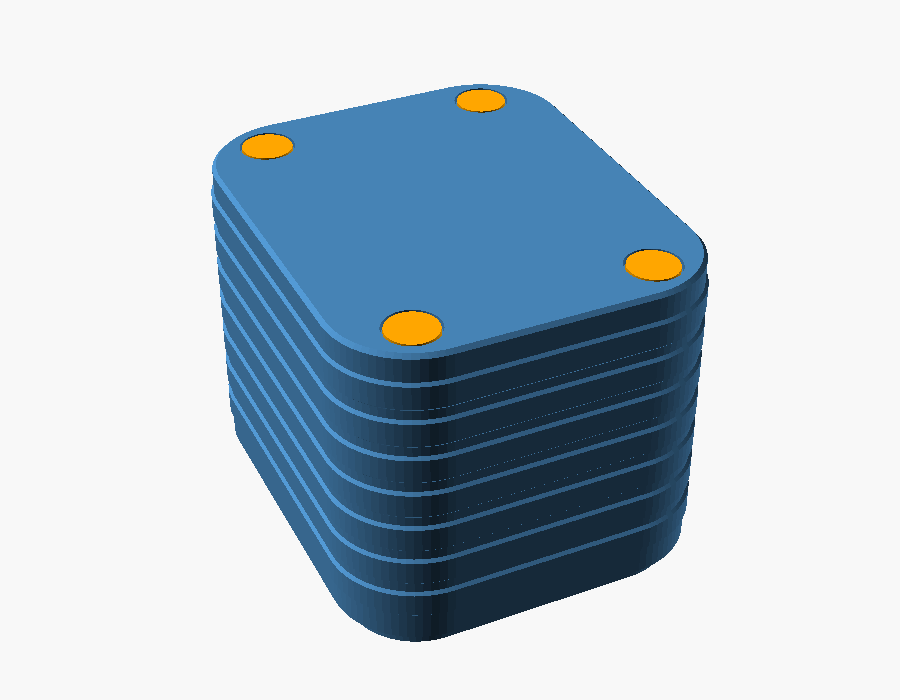
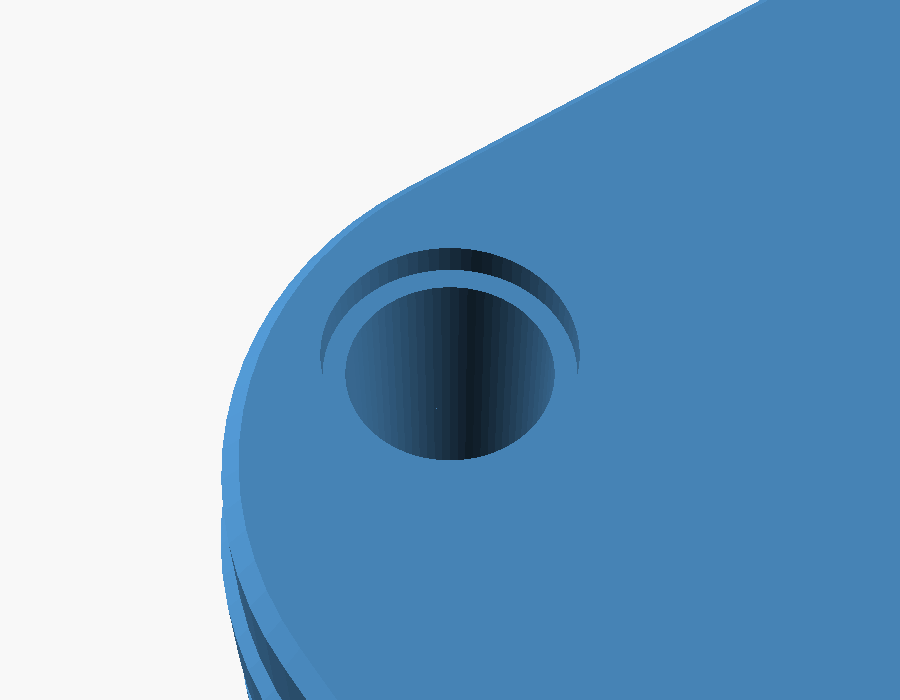
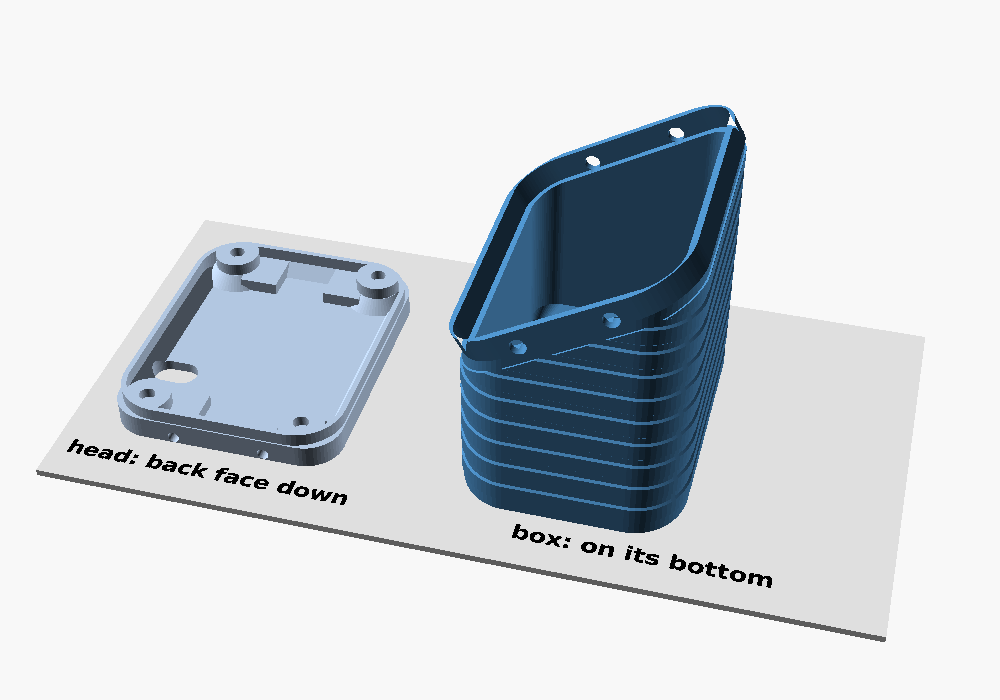
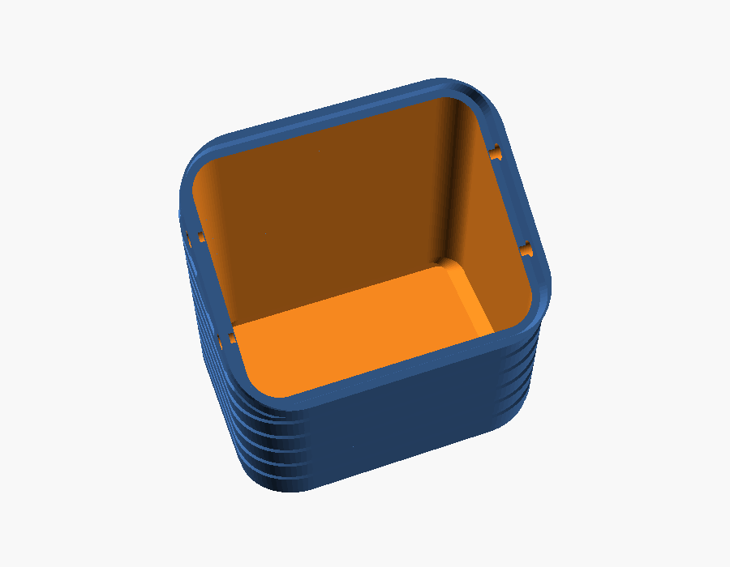
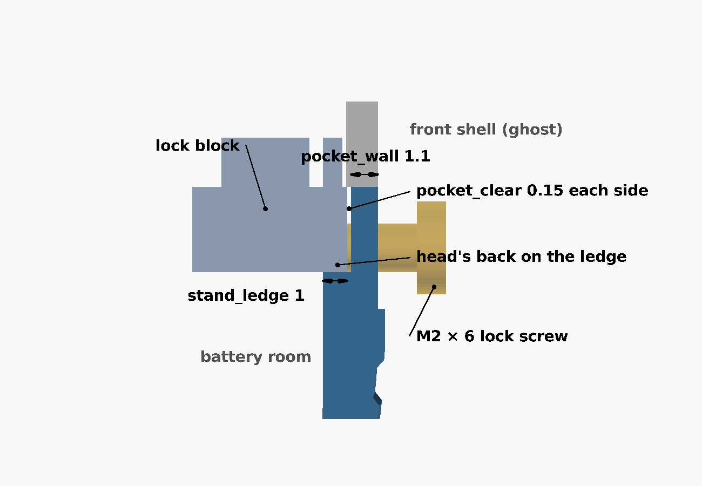
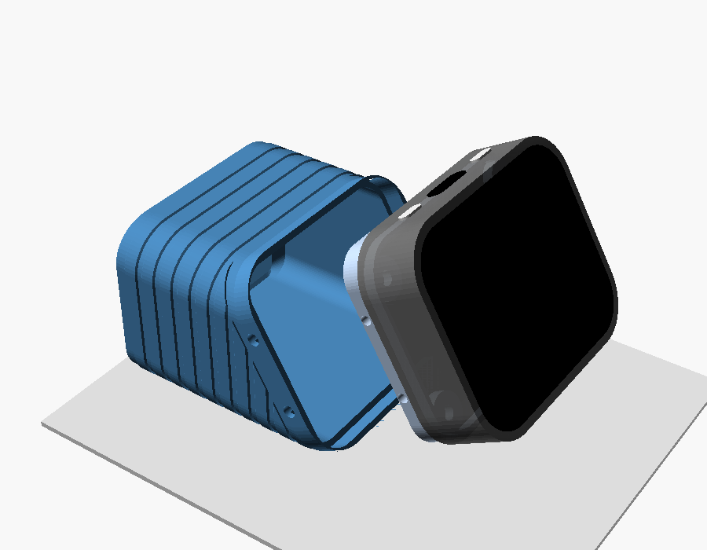

# Printing and assembly

> **Status:** Living · **Last verified:** 2026-09-23

Everything from buying parts to a finished unit. Back to the [README](README.md).

## 1. Get the parts

| Part | Notes |
|---|---|
| **Battery** | 3.7 V single-cell LiPo matching your version (103035, 802525 or 104050) with a **1.25 mm two-pin plug** — sold as "MX1.25", "Micro JST 1.25" or "PicoBlade". A 2.0 mm "JST PH" plug won't fit the board: swap the plug or use an adapter. |
| **4 × M2 × 4 socket head cap screws** | ISO 4762 / DIN 912, the round head with a hex socket. Don't go longer without reading [screw length](DESIGN.md#screws): too long presses on the display. |
| **1.5 mm hex key or driver** | Must reach down a 4.6 mm hole: about 35 mm for the default, 15 mm for the flat version, 60 mm+ for the tall one (the console gives each). A screwdriver-style hex driver is easiest. |
| **1 mm double-sided VHB tape** | Holds the battery to the floor. |
| **1.5 mm foam** | Thin craft or gasket foam, on top of the battery and in the gaps. |
| **2 mm drill bit** | Turned by hand, clears the thin skin at the top of each screw tower. |

## 2. Print

| Setting | Value |
|---|---|
| Orientation | Flat back face down, rim up — as the file loads. **No supports.** |
| Material | PETG (or ABS). PLA softens in a hot car. |
| Layer height | 0.2 mm |
| Walls / perimeters | 3 or more. The rim is 0.8 mm: check the slicer preview shows it solid (two lines). |
| Infill | 40 % or more |
| Plugs | As laid out in their file, flat caps down; same material if you want them to match. |

Everything that isn't straight up is sloped at 45° or less, so nothing needs support. The only
flat overhang is a thin skin closing the top of each screw hole, which bridges cleanly — and
which you clear in step 3.

**Do a quick test print before a keeper**, and try it on the unit (steps 3–4). If anything is
off, [TROUBLESHOOTING.md](TROUBLESHOOTING.md) says which number to change.

## 3. Clear the screw towers

Each screw runs up a hollow tower, and its hole is closed at the top by a thin printed skin
(`bridge_skin`, two layers) so the printer can bridge it. Drill it through with a 2 mm bit turned
by hand; the screw alone may struggle.

## 4. Test-fit

With no battery in, set the plate on the front shell. The rim should slide in without forcing,
and the four towers should line up with the four brass nuts on the board.

Check too that nothing on the board was resting on the stock cover's inner rails or raised block
(the speaker, for instance): this plate doesn't copy them.

## 5. Fit the battery

1. **Check the plug's polarity first.** Compare the battery's wires with the `+` and `−` marks
   beside the board's `BAT` socket. Cheap batteries don't agree on which is which; if it's
   reversed, swap the two pins in the plug with a needle before connecting.
2. **Tape it down**: VHB on the floor, battery on top, wire end toward the end with the orange
   wire room below. Trim the tape so it lies flat instead of climbing the sloped edges.
3. **Plug it in**, lay the foam on top, and pack a little foam in any gap so it can't shift.

## 6. Close it up

Seat the plate on the front shell. Drop a screw down each tower and turn it with the hex key
until snug — the screw head bears on the seat at the top of the tower, and the tower top presses
the board's nut. Don't crank it.

## 7. Plugs (optional — not for babies)

Press one into each opening on the back until the cap sits flush. To reach a screw again, pry a
plug out with a knife tip in the small gap around its cap.

| Without plugs | With plugs |
|---|---|
|  |  |
|  |  |

## Desk stand

The two-part version ([README](README.md#or-the-desk-stand)). Parts are the same as above, except:

| Part | Notes |
|---|---|
| **Head** | `amoled18_stand_head.stl`: one, whatever the battery |
| **Box** | `amoled18_stand_box_<battery>.stl`, for your battery |
| **4 × M2 × 4 socket head screws** | Display to head, as for the plate. Any short 1.5 mm hex key reaches: the towers are only 3.5 mm deep |
| **4 × M2 × 6 pan head or wafer head screws** | Head to box, two each side. They cut their own thread in the head. A pan head stands about 1.3 mm proud of the box's side; a wafer (flat) head sits lower |
| No plugs | The head's back is hidden inside the box |

### Print

Both with the settings in step 2. The head goes back face down, like the plate; the box stands
on its bottom as the file loads, sloped top up. Neither needs supports.

The band round the box's angled end — the wall round the head, which the front shell sits on — is
only 1.1 mm thick. Check the slicer preview shows it solid (two or three lines), as for the
plate's rim.

### Assemble

The head screws to the display before it goes into the box, and the battery's plug has to reach
the board through the head, so it goes in this order:

1. **Clear the towers** in the head, as in step 3.
2. **Battery into the box**: check its polarity (step 5). With the box standing as it printed,
   tape the battery to the floor, pushed against the long flat wall — the side the stand will
   lie on. To find the wire end, stand on the long flat wall's side and look down into the box:
   the wires go to your right, the same side as the head's slot.
3. **Plug through the head**: with the head off, feed the battery's plug up through the slot in
   the head's floor, from the back, then push it into the board's `BAT` socket. The socket's
   mouth faces the slot, so the plug goes straight in.
4. **Head onto the display**: seat it on the front shell. It only goes one way that works: the
   slot sits beside the socket, near the screen's bottom edge, right of centre, and the USB-C
   and buttons are on the top edge. Screw it on with the four M2 × 4 (step 6). Keep the box
   beside it while you work; the wire is short.
5. Lay the foam on the battery, tuck the spare wire into the box, and **lower the head into the
   box's sloped end**, USB-C side to the box's short wall — away from the long flat wall. It
   sinks in until its back rests on the ledge inside and the front shell sits on the box's rim.
6. **Lock it**: drive an M2 × 6 through each of the four holes, two on each side of the box,
   into the head. Snug, not tight — it's cutting its own thread in plastic.
7. **Lay it down** on its long flat side, screen facing you: the USB-C and buttons are now along
   the top.

To charge, plug into the USB-C on the top edge; nothing needs taking apart. To take it apart,
undo the four side screws and lift the head out.
