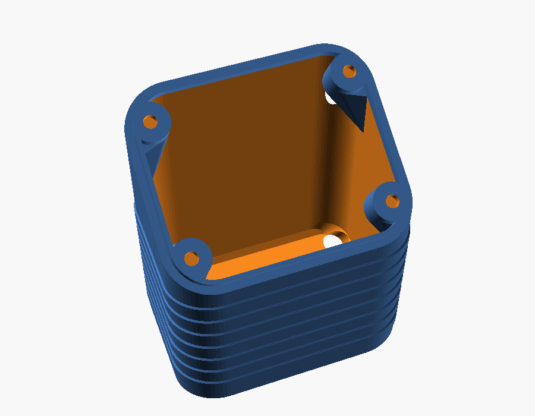
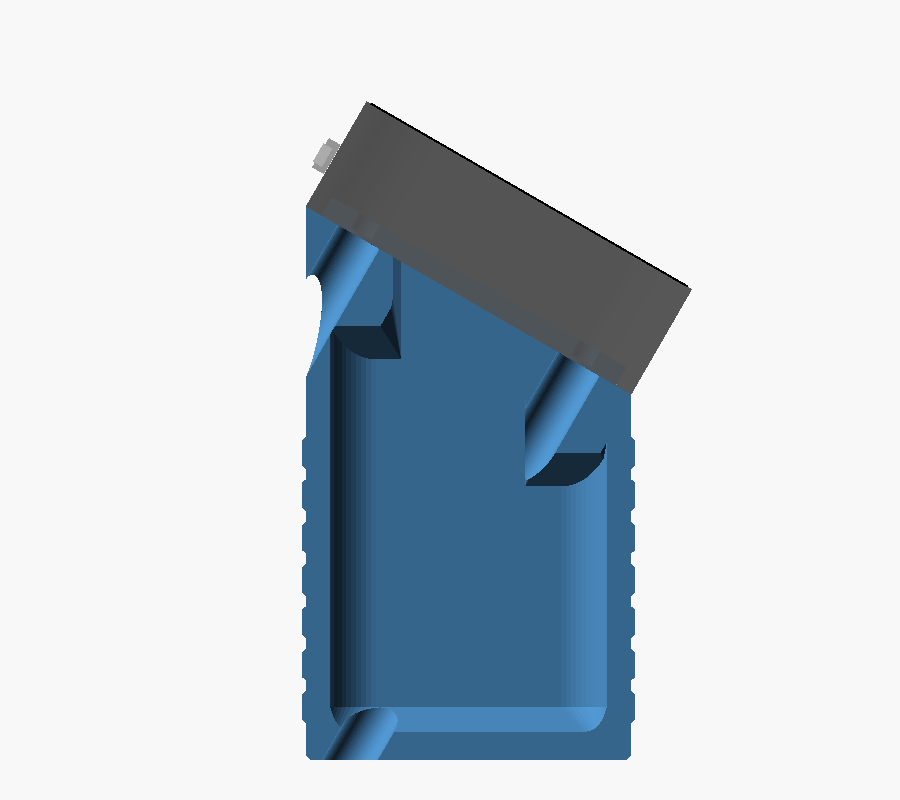
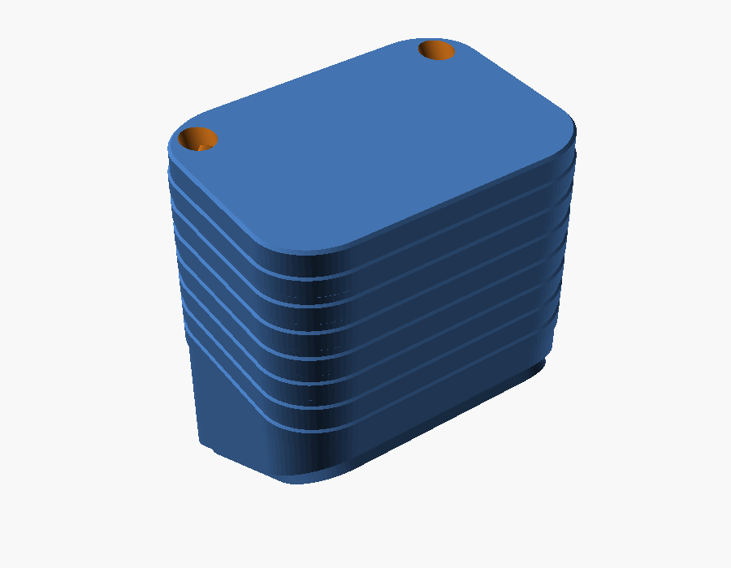

# Printing and assembly

> **Status:** Living · **Last verified:** 2026-09-23

Everything from buying parts to a finished unit. Back to the [README](README.md).

## 1. Get the parts

| Part | Notes |
|---|---|
| **Battery** | 3.7 V single-cell LiPo matching your version (103035, 802525 or 104050) with a **1.25 mm two-pin plug** — sold as "MX1.25", "Micro JST 1.25" or "PicoBlade". A 2.0 mm "JST PH" plug won't fit the board: swap the plug or use an adapter. |
| **4 × M2 × 4 socket head cap screws** | ISO 4762 / DIN 912, the round head with a hex socket. Don't go longer without reading [screw length](DESIGN.md#screws): too long presses on the display. |
| **1.5 mm hex key or driver** | Must reach down a 4.6 mm hole: about 35 mm for the default, 11 mm for the flat version, 60 mm+ for the tall one. A screwdriver-style hex driver is easiest. |
| **1 mm double-sided VHB tape** | Holds the battery to the floor. |
| **1.5 mm foam** | Thin craft or gasket foam, on top of the battery and in the gaps. |
| **2 mm drill bit** | Turned by hand, clears the thin skin at the top of each screw tower. |

## 2. Print

| Setting | Value |
|---|---|
| Orientation | Flat back face down, rim up — as the file loads. **No supports.** |
| Material | PETG (or ABS). PLA softens in a hot car. |
| Layer height | 0.2 mm |
| Walls / perimeters | 3 or more. The rim is 0.8 mm: check the slicer preview shows it solid (two lines). |
| Infill | 40 % or more |
| Plugs | As laid out in their file, flat caps down; same material if you want them to match. |

Everything that isn't straight up is sloped at 45° or less, so nothing needs support. The only
flat overhang is a thin skin closing the top of each screw hole, which bridges cleanly — and
which you clear in step 3.

**Do a quick test print before a keeper**, and try it on the unit (steps 3–4). If anything is
off, [TROUBLESHOOTING.md](TROUBLESHOOTING.md) says which number to change.

## 3. Clear the screw towers

Each screw runs up a hollow tower, and its hole is closed at the top by a thin printed skin
(`bridge_skin`, two layers) so the printer can bridge it. Drill it through with a 2 mm bit turned by hand; the screw alone may
struggle.

## 4. Test-fit

With no battery in, set the plate on the front shell. The rim should slide in without forcing,
and the four towers should line up with the four brass nuts on the board.

Check too that nothing on the board was resting on the stock cover's inner rails or raised block
(the speaker, for instance): this plate doesn't copy them.

## 5. Fit the battery

1. **Check the plug's polarity first.** Compare the battery's wires with the `+` and `−` marks
   beside the board's `BAT` socket. Cheap batteries don't agree on which is which; if it's
   reversed, swap the two pins in the plug with a needle before connecting.
2. **Tape it down**: VHB on the floor, battery on top, wire end toward the end with the orange
   wire room below. Trim the tape so it lies flat instead of climbing the sloped edges.
3. **Plug it in**, lay the foam on top, and pack a little foam in any gap so it can't shift.

## 6. Close it up

Seat the plate on the front shell. Drop a screw down each tower and turn it with the hex key
until snug — the screw head bears on the seat at the top of the tower, and the tower top presses
the board's nut. Don't crank it.

## 7. Plugs (optional — not for babies)

Press one into each opening on the back until the cap sits flush. To reach a screw again, pry a
plug out with a knife tip in the small gap around its cap.

| Without plugs | With plugs |
|---|---|
|  |  |
|  |  |

## Desk stand

The one-piece version ([README](README.md#or-the-desk-stand)). Parts are as above, with a longer
hex key and no plugs:

| Part | Notes |
|---|---|
| **Box** | `amoled18_stand_<battery>.stl` |
| **4 × M2 × 4 socket head screws** | The same as for the plate |
| **1.5 mm hex driver with a long shaft** | About 45 mm for the 103035 box, 20 mm for the 802525 |

**Print** it standing on its bottom, as the file loads, sloped top and rim up, with the settings
in step 2. It needs no supports. Its only overhangs are the tilted skins closing the top of each
screw hole, which bridge like the plate's.

**Clear the towers** as in step 3, but from inside the box through its open top. The drill goes
straight down each tower.

**Assemble:**

1. **Battery in**: check its polarity (step 5). Tape it to the floor against the tall back wall,
   centred left to right. Keep it clear of the two ends: the screws' paths run down there.
2. **Plug it in**: plug the battery into the board's `BAT` socket, lay the foam on top and tuck
   the spare wire in beside the cell, away from the ends.
3. **Seat the display** on the rim, USB-C and buttons along the tall back edge.
4. **Screw it together**: two screws go in through the holes in the bottom, two through the holes
   in the back wall. Drop each screw down its hole on the hex key, find the tower, and turn until
   snug. Hold the unit on its back while you do the bottom two.

To charge, plug into the USB-C on the top edge. To open it, undo the four screws the same way.
