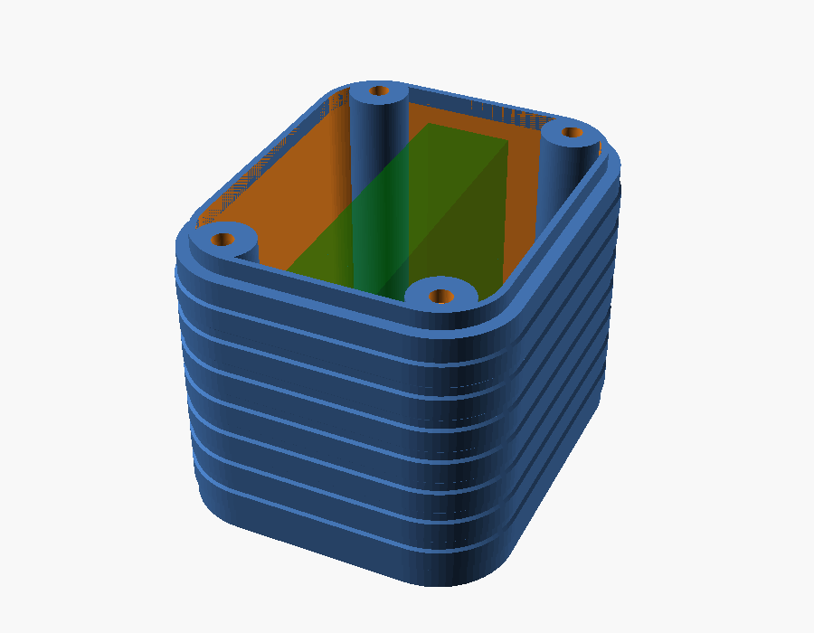
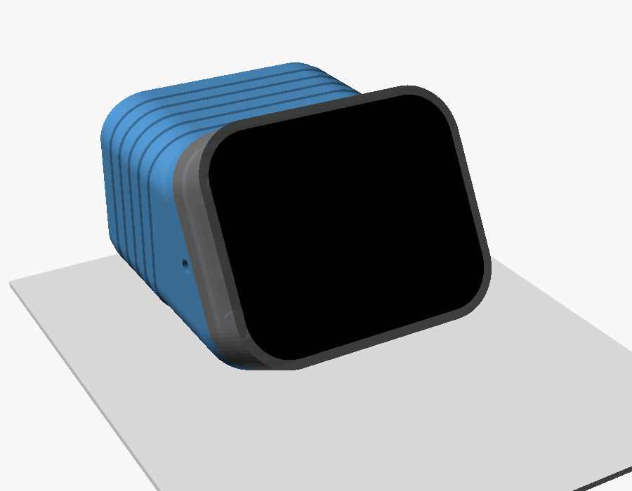

# Deep back plate — ESP32-S3-Touch-AMOLED-1.8

> **Status:** Living · **Last verified:** 2026-09-23

A 3D-printable back cover for the
[Waveshare ESP32-S3-Touch-AMOLED-1.8](https://www.waveshare.com/esp32-s3-touch-amoled-1.8.htm),
the little touchscreen that runs the kids' pet (firmware in [`../../firmware/`](../../firmware/README.md)).
The stock back only fits a tiny battery. This one is a deeper box that holds a real one, screws
on with the original four screw positions, and has grip ribs so small hands don't drop it.

## Pick a version

| | [**103035, 1000 mAh**](renders/version-103035.png) (recommended) | [802525, 400 mAh](renders/version-802525.png) | [104050, 2400 mAh](renders/version-104050.png) |
|---|---|---|---|
| |  |  |  |
| Print | `back_plate_103035_1000mAh_edge.stl` | `back_plate_802525_400mAh_flat.stl` | `back_plate_104050_2400mAh_end.stl` |
| Battery sits | on its edge | flat | on its end |
| Finished unit | 37.6 × 45.2 × 44 mm | 37.6 × 45.2 × 24.7 mm | 37.6 × 45.2 × 67 mm |
| Notes | Roomy fit | Thinnest | Tight fit — measure the cell first |

Green is the battery, red the tape under it, yellow the foam on top. Optional:
`amoled18_hole_plugs.stl`, press-in caps that hide the screw openings — **not for babies, they're
a choking hazard**.

## Or: the desk stand

A two-part version for a desk. A thin **head** screws to the display in place of the stock
cover, then sinks right into the angled end of a plain **battery box**, held by one screw at each
side. The box's rim is the case outline, so the front shell sits flush on it and the head is
hidden inside. The box lies on its long flat side, and the screen faces you, landscape, leaning
back 30° from upright, with the USB-C and buttons along its top edge.
The head is the same for every box, so changing battery only means printing another box.

| | 103035, 1000 mAh (recommended) | 802525, 400 mAh | 104050, 2400 mAh |
|---|---|---|---|
| Print | `amoled18_stand_head.stl` + `amoled18_stand_box_103035_edge.stl` | head + `amoled18_stand_box_802525_flat.stl` | head + `amoled18_stand_box_104050_end.stl` |
| Box | 46 × 45 × 34 mm | 34 × 45 × 34 mm | 70 × 45 × 34 mm |
| With the display on | 56 × 45 × 40 mm | 44 × 45 × 40 mm | 80 × 45 × 40 mm |
| Notes | Roomy | Lowest | Tight fit — measure the cell first |

Sizes are front to back × left to right × height, as it sits on the table. How to print and assemble it:
[PRINTING.md](PRINTING.md#desk-stand).

## The guides

| I want to… | Read |
|---|---|
| Print it and put it together | [**PRINTING.md**](PRINTING.md) |
| Change it: another battery, a better fit, different grip | [**MODEL_ADJUSTMENT.md**](MODEL_ADJUSTMENT.md) |
| Fix something that came out wrong | [**TROUBLESHOOTING.md**](TROUBLESHOOTING.md) |
| Understand how it's built and where every number came from | [DESIGN.md](DESIGN.md) |

## Safety

These go to small children. Keep the hole plugs away from babies (glue them in or leave them
off), never squeeze a lithium pouch cell, don't install one that's puffed or damaged, check the
battery plug's polarity before connecting it, and don't leave it charging unattended.

## What's in this folder

| File | What it is |
|---|---|
| `back_plate_*.stl` | Ready-to-print plates, one per version |
| `amoled18_hole_plugs.stl` | Six press-fit plugs |
| `amoled18_stand_head.stl`, `amoled18_stand_box_*.stl` | The desk stand: one head, a box per battery |
| `amoled18_back_plate.scad` | The adjustable model ([MODEL_ADJUSTMENT.md](MODEL_ADJUSTMENT.md)) |
| `amoled18_back_plate.json` | The versions and the desk stand's parts as OpenSCAD presets |
| `renders/` | Every image in these guides, and `make_renders.sh` to regenerate them |
| `photos/` | The real unit |
| `reference/` | Archived Waveshare drawings, 3D model, schematic and web pages ([reference/README.md](reference/README.md)) |
