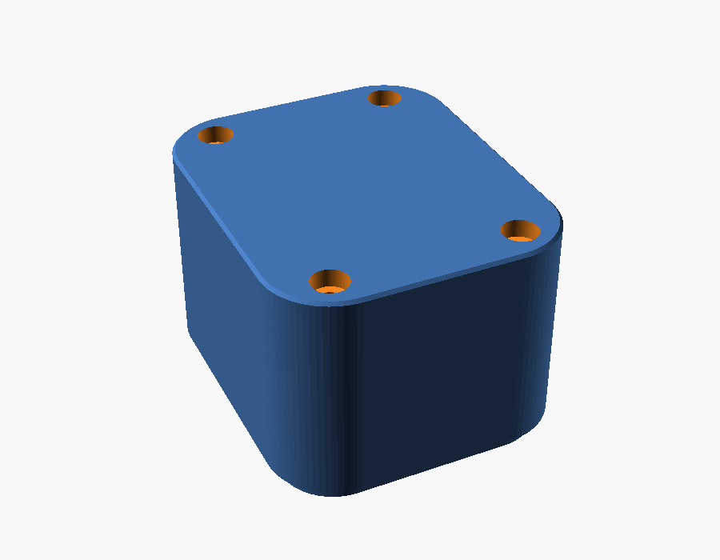
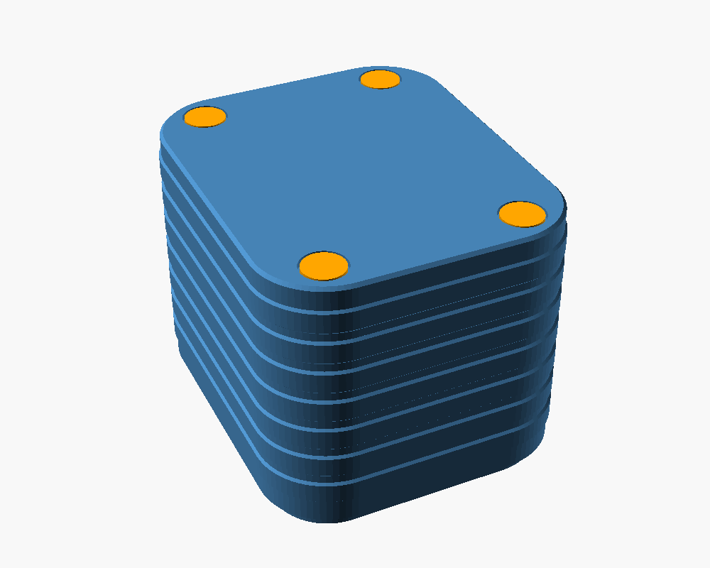
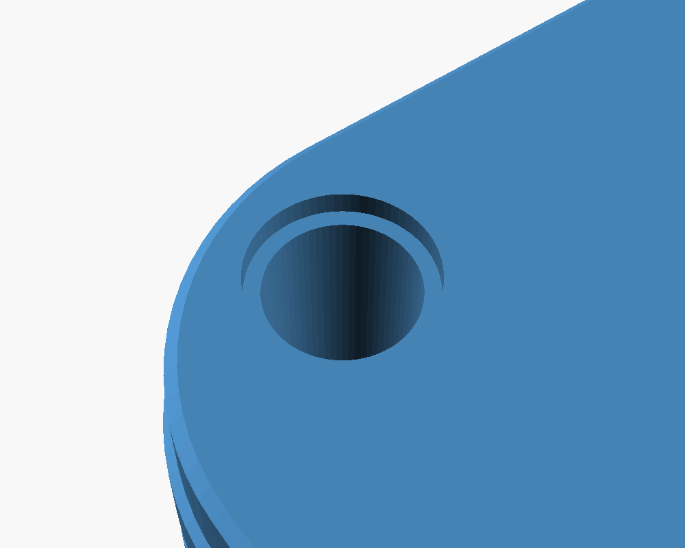
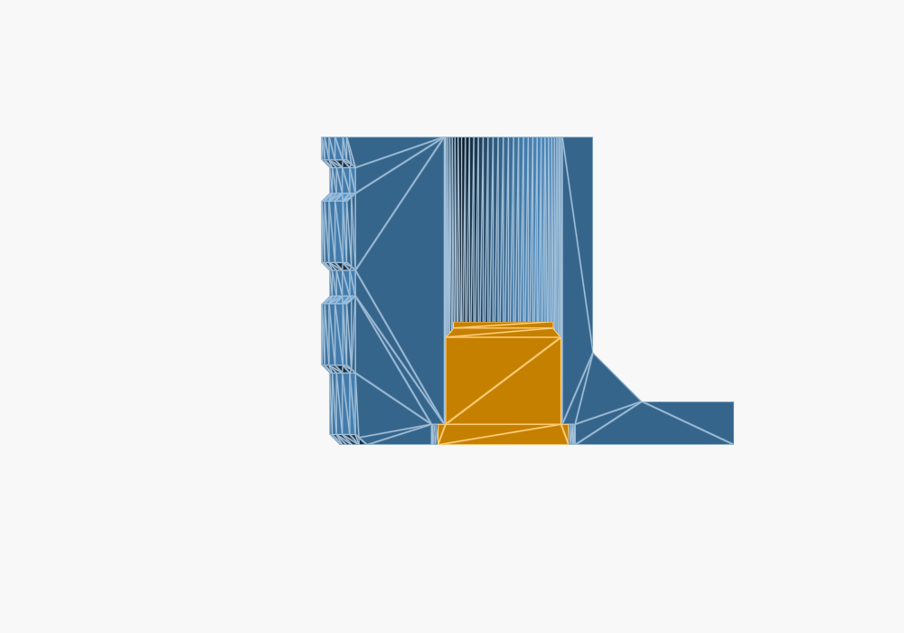
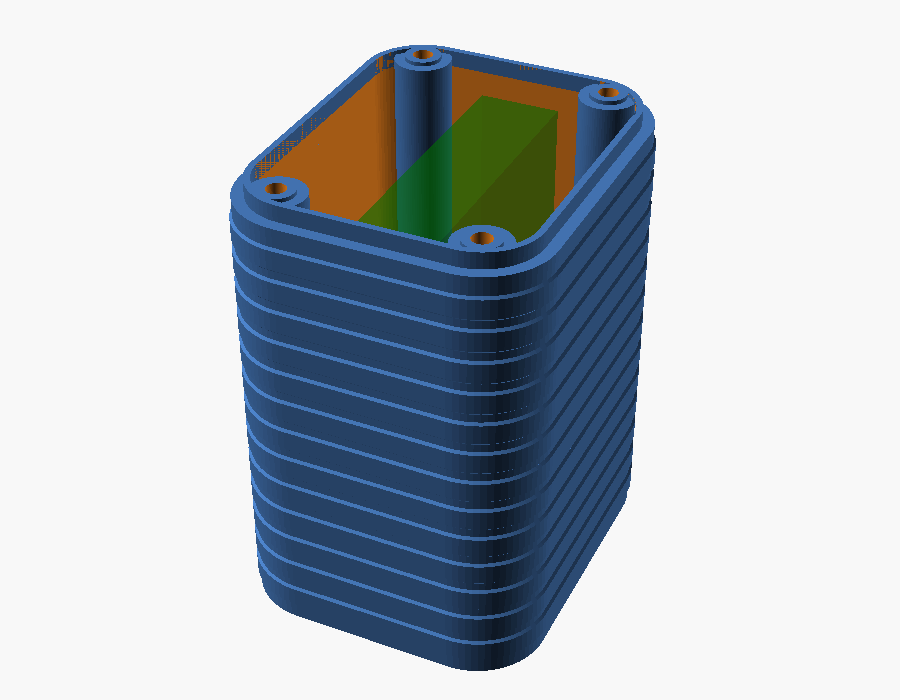

# Deep back plate — ESP32-S3-Touch-AMOLED-1.8

> **Status:** Living · **Last verified:** 2026-09-22

A 3D-printable replacement for the stock back cover of the
[Waveshare ESP32-S3-Touch-AMOLED-1.8](https://www.waveshare.com/esp32-s3-touch-amoled-1.8.htm)
([wiki](https://www.waveshare.com/wiki/ESP32-S3-Touch-AMOLED-1.8),
[sample code](https://github.com/waveshareteam/ESP32-S3-Touch-AMOLED-1.8)) — the panel that
runs the room-endpoint pet firmware in [`../../firmware/`](../../firmware/README.md).

The stock cover leaves almost no room behind the board: Waveshare's largest recommended cell
for the stock case is 3.85 × 24 × 28 mm. This plate is a tall box with straight walls: the
whole inside is open apart from four hollow screw towers, and its depth follows the cell. Any
gaps are padded with foam. The cell plugs into the board's MX1.25 `BAT` connector. Everything
else about the case stays stock: all ports, buttons and the mic are in the **front** shell, so
the plate has no other openings.

The default is a **1000 mAh 103035 cell (10 × 30 × 35 mm) standing on its long edge**, which
makes the unit about **37.6 × 45.2 × 44 mm** (38.2 × 45.8 across the [grip ribs](#grip)), close
to a cube. Along the case it reserves 2 mm at
one end for the wires (`lead_end`) and still leaves 1.85 mm spare at each end for cells that run
over size. A long cell can't lie flat: the screws pass through
24 mm apart across the case, so a 30 mm wide cell would sit across them, but a cell on its edge
is just 10 mm wide there. Smaller cells can lie flat instead (`battery_orientation = flat`); an
802525 lying flat makes the unit about 24.7 mm thick.

The back face is flat apart from four shallow round recesses for the [hole plugs](#hole-plugs),
with only a 0.4 mm chamfer on its edge so it prints cleanly face down.
Each screw runs up a hollow tower and its head sits near the top, so short standard M2 socket
head screws do the job (see [Screws](#screws)).

| Inside, battery ghosted in green | Back face |
|---|---|
|  |  |

## Files

| File | What it is |
|---|---|
| `amoled18_back_plate.scad` | The parametric model. Every dimension is adjustable. |
| `back_plate_103035_1000mAh_edge.stl` | Ready to print: the defaults, for a 103035 cell on its edge. Unit ≈ 44 mm thick. |
| `back_plate_802525_400mAh_flat.stl` | Ready to print for an 802525 cell lying flat. Unit ≈ 24.7 mm thick. |
| `back_plate_104050_2400mAh_end.stl` | **Variation:** a 104050 cell standing on its end. Unit ≈ 67 mm tall. **Tight — measure first.** See [The tall variation](#the-tall-variation-104050-on-end). |
| `amoled18_hole_plugs.stl` | Six press-fit plugs (four plus spares) that hide the screw openings on the back. Fits every plate. See [Hole plugs](#hole-plugs). |
| `amoled18_back_plate.json` | The three plate builds above as presets, selectable in OpenSCAD's Customizer. |
| `preview*.png` | Renders: the inside (battery ghosted in), the back face, a cut through two screw towers, the tall variation, and the plugs (loose, fitted, close up and in section). |
| `photos/` | The real unit: the stock cover's inside, the assembled back, the board in the front shell. |
| `reference/` | Archived copies of Waveshare's drawing, 3D model, schematic and web pages, plus the script that measured them. See [`reference/README.md`](reference/README.md). |

## Step by step, if you've never used OpenSCAD

OpenSCAD is a free CAD program where the shape is described by numbers rather than drawn by
hand. The upside is that you never have to model anything: you change a number in a form
("battery thickness = 8.6"), and the whole part redraws itself to fit. This file was written
that way on purpose, so **you should never need to touch the code** — only the form.

The `.stl` files in this folder are built from the defaults in [Where the numbers come
from](#where-the-numbers-come-from). The outline and screw holes come from Waveshare's own
drawings; the rim and depth are estimates. Print one as a first test, then use the steps below
to adjust anything that doesn't fit.

### 1. Get the files

On the GitHub page for this folder, click `amoled18_back_plate.scad`, then the **download**
button (the down-arrow icon, top right of the file view). Download `amoled18_back_plate.json`
the same way and keep it in the same folder: it holds the ready-made presets. The `.stl` files
are pre-made exports.

### 2. Install OpenSCAD

Download it free from [openscad.org](https://openscad.org/downloads.html) (Windows, Mac,
Linux) and install it like any other program.

### 3. Open the file and find the form

1. Open OpenSCAD, choose **Open**, and pick `amoled18_back_plate.scad`.
2. The window has three parts: the **code** on the left (ignore it), the **3D view** in the
   middle, and — after the next step — the **Customizer** form on the right.
3. If there is no form, go to **Window → Customizer** (on some versions, **View → Hide
   customizer** is ticked — untick it).
4. Press **F5**. The plate appears in the 3D view. Drag to spin it, scroll to zoom.

The form has numbered groups — click a group name to expand it. Each field has a plain-English
label, and most are sliders or drop-downs, so you can't enter something wildly wrong.

### 4. Check the numbers against the stock cover

The outline and screw positions come from Waveshare's own drawings, so they should already be
right. The **rim** and **depth** values are estimates from photos. Before a print you intend to
keep, measure the original black back cover and fix anything that's off. Digital calipers are
ideal; a good ruler works for a first try. All values are in millimetres.

| Form group | Field | What to measure on the stock cover |
|---|---|---|
| 2. Plate outline | `plate_x`, `plate_y` | Overall outside width and height |
| 2. Plate outline | `plate_r` | Roughly how round the outer corners are (radius) |
| 3. Rim | `lip_outer_x`, `lip_outer_y` | Outside width and height of the raised rim that slides into the front shell |
| 3. Rim | `lip_h` | How tall that rim stands |
| 3. Rim | `stock_clear` | Inside depth of the stock cover, rim top down to the floor |
| 4. Screws | `tower_drop` | How far below the rim top the tops of the stock cover's screw posts are (0 if level) |
| 4. Screws | — | The length of one stock screw, for choosing new ones (see [Screws](#screws)) |
| 4. Screws | — | How tall the brass nuts stand off the back of the board, which caps the screw length |
| 4. Screws | `screw_dx`, `screw_dy` | Distance from the **centre** of the plate to the centre of a screw hole, across and up. Easiest: measure hole-to-hole and halve it. |

### 5. Enter the battery you actually have

In **group 1 (Battery)** type the cell's thickness, width and length — they're usually on the
cell's label or listing (the size code reads thickness, width, length: "103035" is
10 × 30 × 35 mm). Measure the real cell if you can, including the little circuit board folded
at the wire end. Then pick `battery_orientation`:

- **edge** — standing on its long edge. Use this for longer cells, up to about 37 mm with the
  default 2 mm of wire room.
- **flat** — lying on its face. Fine for small square cells like 802525.
- **end** — standing upright on its end. Any length fits; the plate just gets taller.

Set `tape_t` and `foam_t` to the thickness of the tape and foam you'll use, and `lead_space` to
the room the wires and plug need above the cell (3 mm is plenty for a cell on its end). For a cell
lying flat or on its edge, whose wires come out of one end, `lead_end` reserves room past that
end (2 mm). The plate's depth follows automatically.

A 40 mm long cell (such as an 852540) doesn't fit flat or on its edge once its wires have room:
the console says so and OpenSCAD refuses to export.

Shortcut: the drop-down at the top of the Customizer has the three builds in this folder as
presets. Pick one and every battery setting fills in.

### 6. Check the console for warnings

Press **F5** again after changing values. At the bottom of the window is the **console**
(if it's hidden: **Window → Console**). It prints a summary block, and the last line should
say **`All checks passed.`** If instead it says `CELL DOES NOT FIT`,
the battery is too big for this plate — pick a smaller cell or adjust the flagged value.

A line starting **`TIGHT:`** means the cell fits its listed size with under 0.5 mm to spare;
real cells often run up to half a millimetre over, so measure yours before printing.

### 7. Export the file for the printer

1. Press **F6** to do the full render. This can take a minute; wait until the progress bar
   finishes and the console says it's done.
2. Press **F7** (or **File → Export → Export as STL**) and save it.

F5 is just a quick preview; export only works after F6.

### 8. Slice and print

Open the exported `.stl` in your usual slicer (Bambu Studio, PrusaSlicer, Cura, …) and use the
settings in [Printing](#printing) below: flat face down, rim up, no supports.

**Do a test print first.** Print one quickly and hold it against the front shell to check the
rim slides in and the four towers line up with the brass nuts on the board. The stock cover
also has side rails and a raised block inside that this plate doesn't copy; check nothing on the
board (the speaker, for instance) was resting on them. If something is off, measure
again, change the number, and re-export — that's the whole point of the parametric file.

### 9. Save your numbers

The form remembers your values only while the file is open. To keep them, use the **preset**
bar at the top of the Customizer: click **+**, name it (e.g. `my 802525`), and it's saved
alongside the `.scad` file.

## Where the numbers come from

Sources: Waveshare's [dimension drawing](https://docs.waveshare.com/ESP32-S3-Touch-AMOLED-1.8)
and [3D model](https://files.waveshare.com/wiki/ESP32-S3-Touch-AMOLED-1.8/ESP32-S3-Touch-AMOLED-1.8-3D.zip)
(from the [resources page](https://docs.waveshare.com/ESP32-S3-Touch-AMOLED-1.8/Resources-And-Documents)),
and the photos in `photos/`. Copies of Waveshare's files are in [`reference/`](reference/README.md),
with `reference/measure.py` to re-derive the numbers. The 3D model has the board and display
but not the case shells.

| Default | Value | Source | Confidence |
|---|---|---|---|
| `plate_x` × `plate_y` | 37.6 × 45.2 | Case outline, dimension drawing | High (official) |
| `screw_dx`, `screw_dy` | 12.0, 18.0 (24 × 36 apart) | PCB mounting holes in the 3D model. The drawing and all three photos agree to within ~0.7 mm. | High |
| `plate_r` | 8.7 | Circle fitted to the case corners in the dimension drawing | Good, ±0.5 |
| `lip_outer_x` × `lip_outer_y`, `lip_outer_r` | 35.0 × 42.6, 7.4 | Outline minus a ~1.3 mm front-shell wall, estimated from the photos. (The board itself is 33.0 × 40.6.) | Estimate: **measure** |
| `stock_clear` | 3.9 | The stock cover shows 3.5 mm on the side view; depth derived from that and the rim height | Estimate: **measure** |
| `lip_h` | 2.0 | Not visible in any source | Guess: **measure** |
| `lip_wall` | 0.8 | Chosen, not measured: the walls run straight up to the rim, so the rim's inside is the cavity, and 0.8 mm leaves a 40.7 mm opening, enough for the 40 mm-wide 104050 on end. Two nozzle widths, plenty for a 2 mm locating lip. | Design choice |
| `screw_size` | M2 | Screw heads measure ~3.8 mm across in the drawing, which matches M2 (the stock ones are Phillips) | Likely: check a stock screw |
| Tower bore | Ø4.6 | ISO 4762 M2 socket head (Ø3.8) + `head_clear` 0.6 + `hole_slop` 0.2 | Standard |
| `tower_drop` | 0 | Towers stop level with the rim top. Where the stock posts stop isn't visible in any source | Guess: **measure** |

For reference, the whole stock unit is 15.0 mm thick, and the back label window is
27.6 × 27.6 mm with R1.8 corners.

## Screws

The brass nuts the screws thread into are soldered to the **board**, not the case. On the stock
cover, a post around each screw presses on its nut, so tightening the screws clamps the board in
place. This plate does the same with four hollow towers, one per screw, running from the back
face to the rim top:

- The bore is wide enough (Ø4.6 mm) for the screw head and a hex key, from the back face up to
  the **seat**: 2 mm of plastic at the top of the tower (`head_seat`). The screw head rests under
  the seat, and the tower top presses on the nut.
- Only a small pad at the very top touches the board: Ø4.5 mm around the nut, standing 0.5 mm
  proud of the rest of the tower (`nut_pad_d`, `nut_pad_h`). Waveshare's 3D model has small
  parts on the board about 3 mm from some nuts, and the pad keeps the wider tower off them.
- So the screw only has to pass through the seat and into the nut. Short standard screws do it,
  whichever battery or height you pick.
- The top of each bore is closed by one printed layer (`bridge_skin`, 0.2 mm) so the printer can
  bridge it cleanly. **Push it through with the screw or a 2 mm drill before assembly.**
- `tower_drop` lowers the towers if the stock posts turn out to stop short of the rim top.

Use **M2 socket head cap screws** (ISO 4762 / DIN 912 — the round head with a hex-key socket).
To choose the length:

1. Push a stock screw through the stock cover and measure how far it sticks out past the top of
   its post. That's how far it goes into the nut.
2. Screw length = 2 mm (the seat) + that, rounded **down** to a length that's sold. Never go
   longer: the display sits right against the front of the board, so a screw that passes
   through the nut presses on it. The hard limit is 2 mm + the nut's height + 1.2 mm (the
   board), less half a millimetre.

If you can't measure a stock screw, use **M2 × 4**. Go to M2 × 5 only if the nut turns out to
be at least 2 mm tall.

Drive them with a **1.5 mm hex key long enough to reach down the tower**. The console's
`Hex key reach` line gives the depth: about 33 mm for the default, 11 mm for the flat 802525
and 56 mm for the tall variation. A screwdriver-style 1.5 mm hex driver with a shaft of 60 mm or
more reaches all of them.

## Hole plugs

Each tower opening on the back face has a shallow recess (Ø5.6 × 0.8 mm), and
`amoled18_hole_plugs.stl` has six plugs that press into them so the back reads as one flat face.
Each plug is a thin cap with a ribbed shank: the six ribs crush slightly as it goes in, which
makes a firm press fit without glue.

- **Print them cap-down** (as laid out in the file), so the face that shows is the smooth one
  from the bed. Same material as the plate if you want them to match.
- **Push them in by hand** once the screws are tight; a flat tool helps the last bit. The cap
  sits flush.
- **To get at a screw again**, pry a plug out with a knife tip in the small gap around its cap.
- **If they're loose or too tight**, change `plug_interference` in group 4c (up for looser
  printers, down for tighter) and export again. In OpenSCAD, set `part` in group 6 to `plugs` to
  export just the plugs, or `both` to see them next to the plate. `plug_recess` turns the
  recesses off if you'd rather leave the openings plain.

| The six plugs | Back without plugs | Back with plugs fitted |
|---|---|---|
|  |  |  |

| Opening, close up | Plug fitted, close up | Section through a fitted plug |
|---|---|---|
|  |  |  |

In the section (orange is the plug), the cap fills the recess flush with the back face and the
ribbed shank grips the bore. The screw head sits far above it, under the seat at the top of the
tower.

## Grip

The outside walls carry horizontal ribs so small hands don't drop it: bands 3 mm tall that stand
0.3 mm proud with 45° slopes top and bottom, running right round the body, corners included.
They print as plain layers, need no supports, wipe clean, and stop 1.5 mm short of the bed edge
and of the seam with the front shell. At the ribs the plate measures 38.2 × 45.8 mm, 0.3 mm
proud of the front shell on each side.

Group 5b adjusts them. `grip_depth` is how far they stand out, in millimetres: 0 gives smooth
walls, 0.3 is the default, 0.5 the most. `grip_size` (band height), `grip_gap` and
`grip_margin` set the spacing. `grip_style` also offers `honeycomb` (raised hexagons) and
`nubs` (raised squares) on the flat sides, or `none` for smooth walls.

## The tall variation: 104050 on end

A 104050 cell (10 × 40 × 50 mm, sold as 2400 mAh; expect about 2000) standing on its 10 × 40
face, circuit board and wires at the top. The unit comes out about **37.6 × 45.2 × 67 mm**, with
roughly twice the capacity of the default and 5–6× the 802525. Select the
`104050 2400mAh on end (tight, measure first)` preset, or print `back_plate_104050_2400mAh_end.stl`.

Things to know before building it:

- **The fit along the case is tight:** 40 mm in a 40.7 mm opening, 0.35 mm per end. Measure the
  real cell. If it's over 40 mm, set `lip_wall` to 0.6, which opens the space to 41.1 mm.
- **The common listing has the wrong plug.** It ships with a JST PH 2.0 mm plug; the board
  needs MX1.25 (1.25 mm). Swap the plug for a 1.25 mm two-pin one, or use a short PH 2.0 to
  Micro JST 1.25 adapter; there's room beside the cell for either. Check which pin is + and
  which is − against the board's `BAT` marks before plugging in.
- **The screws are the same short M2s as every other version** — the towers take the height —
  but the hex key has to reach about 56 mm down each tower.

## Battery mounting

The walls are braced by a 45° chamfer where they meet the floor, all the way around the inside
(`wall_chamfer`, 3 mm). On any wall the cell sits close to, it shrinks by itself so it never
lifts the cell: it always keeps 0.5 mm clear of the cell's bottom edge, or stays below the
tape where the cell is closer than that. Each screw tower gets the same treatment where it meets
the floor: a 45° flare (`tower_flare`, 2 mm), shrinking by the same rule near the cell. With the default cell it's 3 mm on the long walls and
2.45 mm on the end walls; OpenSCAD's console prints both. Trim the tape so it sits flat on the
floor rather than riding up the chamfer.

The cell is held by double-sided VHB tape on the floor and foam padding above it, which presses
it down when the case closes. The cavity is deliberately open rather than shaped to the cell;
pack foam into the gaps around it so it can't shift. Set `tape_t` and `foam_t` to what you
actually have; both add to the depth. With the default cell there's almost 4 mm at the wire
end and over 11 mm beside it for the wires to reach the `BAT` connector. Keep the cell and its
foam clear of the connector: it stands 3.5 mm off the back of the board, on one long side about
halfway along. That's why the flat 802525 preset leaves 2 mm extra above the cell
(`lead_space`).

## Printing

| Setting | Value |
|---|---|
| Orientation | Flat face down, rim up. No supports. |
| Screw towers | The top of each bore is closed by a one-layer bridge; push it through after printing. |
| Layer | 0.2 mm |
| Perimeters | 3 or more (the walls and screw towers take the load). The rim is 0.8 mm, so it prints as 2 lines — check the slicer preview shows it solid. |
| Infill | 40 %+ |
| Material | PETG or ABS — PLA softens in a warm car. |

## Safety

These go to kids. Never pinch or compress a lithium pouch cell — keep the clearance the model
allows. Don't install a cell that is puffed, dented or damaged, and don't leave one charging
unattended.

**The hole plugs are a choking hazard for babies and toddlers.** They're about 5 mm across and a
determined kid can pry one out. For small children, glue them in, or leave them off and set
`plug_recess` to off so the back is plain.

## Photos

| Stock cover, inside | Assembled back | Board in the front shell |
|---|---|---|
|  |  |  |
