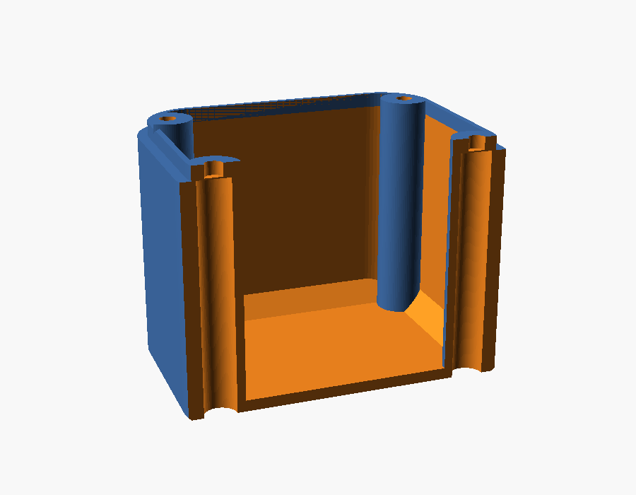

# Deep back plate — ESP32-S3-Touch-AMOLED-1.8

> **Status:** Living · **Last verified:** 2026-09-23

A 3D-printable replacement for the stock back cover of the
[Waveshare ESP32-S3-Touch-AMOLED-1.8](https://www.waveshare.com/esp32-s3-touch-amoled-1.8.htm)
([wiki](https://www.waveshare.com/wiki/ESP32-S3-Touch-AMOLED-1.8),
[sample code](https://github.com/waveshareteam/ESP32-S3-Touch-AMOLED-1.8)) — the panel that
runs the room-endpoint pet firmware in [`../../firmware/`](../../firmware/README.md). The stock
cover only fits a tiny battery; this one is a deeper box that holds a real one.

| Inside, battery ghosted in green | Back face |
|---|---|
|  |  |

**This page in three parts:**

1. [**Quick start**](#quick-start) — what to buy, which file to print, how to put it together.
2. [**Changing the model**](#changing-the-model) — which setting to change for what you want.
3. [**Fixing problems after printing**](#fixing-problems-after-printing) — symptom → fix.

Everything else ([how it works](#how-it-works), [where the numbers come from](#where-the-numbers-come-from),
[safety](#safety)) is further down for when you need it.

---

## Quick start

### 1. Pick a version

| File | Battery | Finished unit | Screws |
|---|---|---|---|
| **`back_plate_103035_1000mAh_edge.stl`** (recommended) | 103035, 1000 mAh, 10 × 30 × 35 mm, standing on its edge | 37.6 × 45.2 × 44 mm | M2 × 4 |
| `back_plate_802525_400mAh_flat.stl` | 802525, 400 mAh, 8 × 25 × 25 mm, lying flat | 37.6 × 45.2 × 24.7 mm | M2 × 4 |
| `back_plate_104050_2400mAh_end.stl` | 104050, 2400 mAh, 10 × 40 × 50 mm, standing on end — **tight fit, [read this first](#the-tall-104050-version)** | 37.6 × 45.2 × 67 mm | M2 × 4 |
| `amoled18_hole_plugs.stl` (optional) | — | Six caps that hide the screw openings. **Not for babies — [choking hazard](#safety).** | — |

"Finished unit" is the whole device: display, front shell and this plate. The grip ribs add
0.3 mm on each side.

### 2. Get the parts

- **The battery.** A 3.7 V single-cell LiPo with a **1.25 mm two-pin plug** (sold as "MX1.25",
  "Micro JST 1.25" or "PicoBlade"). A 2.0 mm "JST PH" plug won't fit the board: swap the plug or
  use an adapter.
- **4 × M2 × 4 socket head cap screws** (ISO 4762 / DIN 912, the round head with a hex socket).
  Don't use longer ones without reading [Screws](#screws): a screw that's too long presses on
  the display.
- **A 1.5 mm hex key or driver** that reaches about 35 mm down a 4.6 mm hole (60 mm or more for
  the tall version). A screwdriver-style hex driver is easiest.
- **1 mm double-sided VHB tape** and **1.5 mm foam** (the thin craft or gasket kind).
- Optional: a **2 mm drill bit**, to clear the thin printed layer in each screw tower.

### 3. Print it

| Setting | Value |
|---|---|
| Orientation | Flat back face down on the bed, rim up. **No supports.** |
| Material | PETG (or ABS). PLA softens in a hot car. |
| Layer height | 0.2 mm |
| Walls / perimeters | 3 or more. The rim is only 0.8 mm, so check the slicer preview shows it solid (2 lines). |
| Infill | 40 % or more |
| Plugs | Print them as laid out in their file, flat caps down. |

**Before a keeper, do a quick test print** and try it on the unit (step 4). If anything is off,
[Fixing problems after printing](#fixing-problems-after-printing) says which number to change.

### 4. Put it together

1. **Clear the screw towers.** Each tower's hole is closed at the top by one thin printed layer
   (it lets the printer bridge cleanly). Poke it through with a 2 mm drill turned by hand, or
   with the screw itself.
2. **Test-fit the plate** on the front shell with no battery: the rim should slide in without
   forcing and the four holes should line up with the four brass nuts on the board.
3. **Check the battery's plug** against the `+` and `−` marks by the board's `BAT` socket
   *before* plugging it in. Cheap batteries don't agree on which wire is which; if it's
   reversed, swap the two pins in the plug with a needle.
4. **Tape the battery down**: VHB on the floor of the plate, battery on top, wires toward the
   end with the most room. Trim the tape so it lies flat rather than climbing the sloped edges.
5. **Plug in the battery**, lay the foam on top of it, and pack a little foam in any gaps so it
   can't shift.
6. **Close it up**: seat the plate on the front shell, drop each screw down its tower and
   tighten with the hex key until snug. Don't crank it: the tower tops press on the board.
7. **Plugs (optional)**: press one into each opening on the back until flush.

---

## Changing the model

You only need this if a pre-made file doesn't suit, or if [troubleshooting](#fixing-problems-after-printing)
tells you to change a number. You never edit code: everything is a labelled field.

### How to open and export (first time)

1. Install [OpenSCAD](https://openscad.org/downloads.html) (free, Windows/Mac/Linux).
2. Download `amoled18_back_plate.scad` **and** `amoled18_back_plate.json` from this folder into
   the same folder on your computer (on GitHub: click the file, then the download icon). The
   `.json` holds the ready-made versions.
3. Open the `.scad` in OpenSCAD. Turn on the form with **Window → Customizer** (on some
   versions untick **View → Hide customizer**). Press **F5** to see the part.
4. **Pick a starting point** from the drop-down at the top of the Customizer: the three
   versions above are there. Then change fields; the groups are numbered and each field has a
   plain-English label.
5. **Read the console** at the bottom (**Window → Console** if hidden) after each **F5**. It
   ends with `All checks passed.`, a `TIGHT:` warning (fits, but under 0.5 mm spare — measure
   your cell), or `CELL DOES NOT FIT` (OpenSCAD then refuses to export).
6. **Export**: **F6** (full render, can take a minute), then **F7** to save the `.stl`.
7. **Keep your numbers**: click **+** on the preset bar at the top of the Customizer and name
   them, or they're lost when you close the file.

### What to change for what you want

| You want to… | Change | Where (Customizer group) |
|---|---|---|
| Use a different battery | `battery_t`, `battery_w`, `battery_l` — the size code reads thickness, width, length (103035 = 10 × 30 × 35) | 1. Battery |
| Stand it up, lay it flat, or stand it on end | `battery_orientation`: **edge** for cells up to ~37 mm long, **flat** for small square cells, **end** for long cells (the plate grows taller) | 1. Battery |
| Allow for different tape or foam | `tape_t`, `foam_t` | 1. Battery |
| More room for the battery's wires | `lead_end` (past the wire end of a flat or edge cell), `lead_space` (above a cell on end) | 1. Battery |
| Match a measured stock cover | `plate_x`, `plate_y`, `plate_r`, the rim (`lip_…`), `screw_dx`, `screw_dy`, `tower_drop` — see [measuring](#measuring-the-stock-cover) | 2, 3, 4 |
| Make the rim fit tighter or looser | `lip_slop` (bigger = looser) | 3. Rim |
| Screw heads or hex key too tight in the towers | `hole_slop` (bigger = bigger holes) | 4. Screws |
| Towers pressing too hard, or not reaching, the board | `tower_drop` (bigger = shorter towers; negative = taller than the rim) | 4. Screws |
| Different screws | `screw_size` | 4. Screws |
| Plugs looser or tighter | `plug_interference` (bigger = tighter) | 4c. Hole plugs |
| No plug recesses | untick `plug_recess` | 4c. Hole plugs |
| Stronger or weaker grip ribs | `grip_depth`, 0 to 0.5 mm (0 = smooth walls) | 5b. Grip |
| A different grip pattern | `grip_style`: ribs, honeycomb, nubs, none | 5b. Grip |
| Export the plugs instead of the plate | `part`: plate, plugs, or both | 6. Output |
| See the battery in the preview | tick `show_battery` | 6. Output |

### Measuring the stock cover

The outline and screw positions come from Waveshare's own drawings and should already be right.
A few numbers couldn't be seen in any source and are estimates. Measuring these on the original
black cover (calipers ideal, a ruler works) makes a keeper print fit first time:

| Measure | Put it in |
|---|---|
| How tall the rim that slides into the front shell stands | `lip_h` |
| Outside width and length of that rim | `lip_outer_x`, `lip_outer_y` |
| Rim top down to the tops of the screw posts (0 if level; negative if the posts stand higher) | `tower_drop` |
| Inside depth, rim top down to the floor | `stock_clear` (only affects the reported numbers) |
| Hole to hole, across and along, then halve each | `screw_dx`, `screw_dy` |
| How far a stock screw sticks out past its post, and how tall the brass nuts stand off the board | Choosing screw length — see [Screws](#screws) |

---

## Fixing problems after printing

| Problem | Likely cause | Fix |
|---|---|---|
| **Rim won't go into the front shell** | Rim a little too big | Raise `lip_slop` by 0.1, or measure the rim and lower `lip_outer_x` / `lip_outer_y` |
| **Plate wobbles or rattles on the shell** | Rim a little small | Lower `lip_slop` by 0.1 (not below 0), or raise `lip_outer_x` / `lip_outer_y` |
| **Holes don't line up with the brass nuts** | Screw spacing | Measure hole to hole on the stock cover and set `screw_dx` / `screw_dy` to half of each |
| **Screw won't go down the tower**, or the hex key jams | Bore printed small, or the thin top layer isn't cleared | Clear the top layer with a 2 mm drill; if the bore itself is tight, raise `hole_slop` by 0.1 |
| **Gap at the seam when the screws are tight**, or the board feels pushed forward | Towers too tall | Measure the gap and raise `tower_drop` by that much |
| **Board rattles, or the screws pull it backwards** | Towers too short to reach the nuts | Lower `tower_drop` (it can go negative) by the gap you see |
| **Screw spins without gripping** | Screw too short | Next length up — but stay under the limit in [Screws](#screws) |
| **Screw feels like it hits something**, or the display looks pressed | Screw too long | Stop. Use a shorter screw; the tip is reaching the display |
| **Battery won't fit** | Cell bigger than its listing, or wires in the way | Measure the cell (including the folded circuit board at the wire end), enter it, and check the console; or raise `lead_end` |
| **Battery slides around** | Too much space | More foam; that's what it's for |
| **Foam or battery pressing on the board** | Too little headroom | Thinner foam, or raise `lead_space` by 1–2 mm |
| **Plugs fall out** | Printer makes holes big | Raise `plug_interference` by 0.05, export `part = plugs` again |
| **Plugs won't go in** | Printer makes holes small | Lower `plug_interference` by 0.05 |
| **Plug won't sit flush** | Stringing in the recess | Clean the recess with a knife; or lower `plug_cap_t` a touch |
| **Back edge flares out at the bottom** (elephant's foot) | First layer squished | Raise `edge_chamfer` to 0.6, or lower bed temperature |
| **Corners lift off the bed** | Warping | Use a brim; clean the bed; PETG on a textured or glue-sticked bed |
| **Rim prints thin or broken** | Slicer drew 1 line instead of 2 | In the slicer, enable thin-wall detection / "Arachne"; or raise `lip_wall` to 1.0 (costs 0.4 mm of battery room) |
| **Ribs too strong or too subtle** | Taste | `grip_depth`: 0.2–0.5, or 0 for smooth |
| **Unit too thick** | Battery choice | Use the flat 802525 version (24.7 mm) |

Anything else: open the `.scad`, press **F5**, and read the console — it prints every clearance
the model worked out.

---

## How it works

### Battery cavity

The plate is a box with straight walls: the whole inside is open apart from four screw towers,
and its depth follows the battery. The cell sits on tape with foam above it; the cavity is
deliberately not shaped to the cell, so any gaps are packed with foam. All ports, buttons and
the mic are in the **front** shell, so the plate has no other openings.

- **Orientation.** Across the case the screws are only 24 mm apart, so a wide cell can't lie
  flat past them. Standing a cell on its **edge** makes it just 10 mm wide there; standing it on
  its **end** turns its length into the plate's depth, so any length fits.
- **Wire room.** A pouch cell's wires come out of one end. `lead_end` (2 mm) keeps that much
  free past the wire end; the default still has 1.85 mm spare at each end beyond that. A 40 mm
  cell such as an 852540 doesn't fit flat or on its edge once its wires have room.
- **Clearance rules.** The console warns `TIGHT` when anything is closer than 0.5 mm to the cell
  and refuses to export under 0.2 mm, because real cells often run half a millimetre over.
- **Bracing.** A 45° chamfer runs where the walls meet the floor (`wall_chamfer`, 3 mm), and a
  45° flare where each tower meets the floor (`tower_flare`, 2 mm). Both shrink by themselves
  near the cell, keeping 0.5 mm off its bottom edge, so they never lift it.
- **The board's `BAT` connector** stands 3.5 mm off the back of the board, on one long side
  about halfway along. The flat 802525 sits under it, which is why that version leaves 2 mm
  extra above the cell (`lead_space`).
- **The rim** that slides into the front shell is the top of the wall itself (0.8 mm thick), so
  it sits squarely on the wall with nothing hanging over air. Its opening sets the cavity size.

### Screws

The brass nuts the screws thread into are soldered to the **board**, not the case. On the stock
cover a post around each screw presses on its nut, so tightening the screws clamps the board.
This plate does the same with four hollow towers from the back face to the rim top:

- The bore (Ø4.6 mm) takes the screw head and hex key up to the **seat**: 2 mm of plastic at
  the top of the tower (`head_seat`). The head rests under the seat; the screw only passes
  through the seat and into the nut, so short screws work at any plate height.
- Only a Ø4.5 mm pad at the very top touches the board, standing 0.5 mm proud of the rest of the
  tower (`nut_pad_d`, `nut_pad_h`), because Waveshare's 3D model has small parts on the board
  about 3 mm from some nuts.
- The top of each bore is closed by one printed layer (`bridge_skin`, 0.2 mm) so the printer can
  bridge it; it's cleared before assembly.

**Choosing the length.** Push a stock screw through the stock cover and measure how far it
sticks out past its post: that's how far it goes into the nut. Length = 2 mm (the seat) + that,
rounded **down** to a length that's sold. The display sits right against the front of the board,
so never exceed 2 mm + the nut's height + 1.2 mm (the board) − 0.5 mm. Without a stock screw to
measure, use **M2 × 4**; go to M2 × 5 only if the nuts are at least 2 mm tall. The console's
`Hex key reach` line gives the depth down each tower: about 33 mm for the default, 11 mm for the
flat version and 56 mm for the tall one.

### Hole plugs

Each tower opening on the back has a shallow recess (Ø5.6 × 0.8 mm). The plugs are thin caps
with a ribbed shank: the six ribs crush slightly as it goes in, for a firm press fit without
glue, and the cap sits flush. A small gap around each cap lets a knife tip pry it out to reach
the screw. `amoled18_hole_plugs.stl` has six (four plus spares).

| The six plugs | Back without plugs | Back with plugs fitted |
|---|---|---|
|  |  |  |

| Opening, close up | Plug fitted, close up | Section through a fitted plug |
|---|---|---|
|  |  |  |

In the section (orange is the plug) the cap fills the recess flush with the back face and the
ribbed shank grips the bore; the screw head sits far above, under the seat.

### Grip

Horizontal ribs run right round the outside, corners included, so small hands don't drop it:
bands 3 mm tall standing 0.3 mm proud (`grip_depth`, 0–0.5 mm, 0 for smooth), with 45° slopes
top and bottom so they print without supports. They stop 1.5 mm short of the bed edge and of the
seam. `grip_style` also offers `honeycomb` (raised hexagons) and `nubs` (raised squares) on the
flat sides.

### The tall 104050 version

A 104050 (10 × 40 × 50 mm, sold as 2400 mAh; expect about 2000) standing on its 10 × 40 face,
circuit board and wires at the top: roughly twice the default's capacity, in a unit about
67 mm tall.

- **The fit is tight**: 40 mm in a 40.7 mm opening, 0.35 mm per end. Measure the real cell. Over
  40 mm, set `lip_wall` to 0.6, which opens the space to 41.1 mm.
- **The common listing ships a JST PH 2.0 mm plug**; swap it for a 1.25 mm one or use a short
  adapter. There's room beside the cell for either.
- **The screws are the same M2 × 4**; the hex driver needs a 60 mm shaft to reach.

---

## Where the numbers come from

Sources: Waveshare's [dimension drawing](https://docs.waveshare.com/ESP32-S3-Touch-AMOLED-1.8)
and [3D model](https://files.waveshare.com/wiki/ESP32-S3-Touch-AMOLED-1.8/ESP32-S3-Touch-AMOLED-1.8-3D.zip)
(from the [resources page](https://docs.waveshare.com/ESP32-S3-Touch-AMOLED-1.8/Resources-And-Documents)),
and the photos in `photos/`. Copies are kept in [`reference/`](reference/README.md), with
`reference/measure.py` to re-derive the numbers. The 3D model has the board and display but not
the case shells.

| Default | Value | Source | Confidence |
|---|---|---|---|
| `plate_x` × `plate_y` | 37.6 × 45.2 | Case outline, dimension drawing | High (official) |
| `screw_dx`, `screw_dy` | 12.0, 18.0 (24 × 36 apart) | PCB mounting holes in the 3D model; the drawing and all three photos agree within ~0.7 mm | High |
| `plate_r` | 8.7 | Circle fitted to the case corners in the drawing | Good, ±0.5 |
| `lip_outer_x` × `lip_outer_y`, `lip_outer_r` | 35.0 × 42.6, 7.4 | Outline minus a ~1.3 mm front-shell wall, from the photos (the board is 33.0 × 40.6) | Estimate: **measure** |
| `lip_h` | 2.0 | Not visible in any source | Guess: **measure** |
| `stock_clear` | 3.9 | The stock cover shows 3.5 mm in the side view; derived from that and the rim height | Estimate |
| `tower_drop` | 0 | Where the stock posts stop isn't visible in any source | Guess: **measure** |
| `lip_wall` | 0.8 | Chosen: the rim's inside is the cavity, and 0.8 mm leaves a 40.7 mm opening | Design choice |
| `screw_size` | M2 | Heads measure ~3.8 mm across in the drawing (the stock ones are Phillips) | Likely |
| Tower bore | Ø4.6 | ISO 4762 M2 head (Ø3.8) + `head_clear` 0.6 + `hole_slop` 0.2 | Standard |

For reference: the whole stock unit is 15.0 mm thick; Waveshare's largest recommended cell for
the stock case is 3.85 × 24 × 28 mm; the stock back label window is 27.6 × 27.6 mm, R1.8. The
stock cover also has side rails and a raised block inside that this plate doesn't copy — on the
test fit, check nothing on the board (the speaker, for instance) was resting on them.

---

## Safety

These go to small children.

- **The hole plugs are a choking hazard for babies and toddlers.** They're about 5 mm across and
  a determined kid can pry one out. For small children glue them in, or leave them off and untick
  `plug_recess` so the back is plain.
- **Never pinch or compress a lithium pouch cell** — keep the clearance the model allows. Don't
  install a cell that is puffed, dented or damaged.
- **Check the plug's polarity** before connecting (Quick start, step 4.3).
- Don't leave it charging unattended.

---

## Files

| File | What it is |
|---|---|
| `amoled18_back_plate.scad` | The parametric model. |
| `amoled18_back_plate.json` | The three versions as Customizer presets. |
| `back_plate_*.stl` | Ready-to-print plates, one per version. |
| `amoled18_hole_plugs.stl` | Six press-fit plugs. |
| `preview*.png` | The renders on this page. |
| `photos/` | The real unit. |
| `reference/` | Archived copies of Waveshare's drawing, 3D model, schematic and web pages, plus the script that measured them. See [`reference/README.md`](reference/README.md). |

## Photos

| Stock cover, inside | Assembled back | Board in the front shell |
|---|---|---|
|  |  |  |
