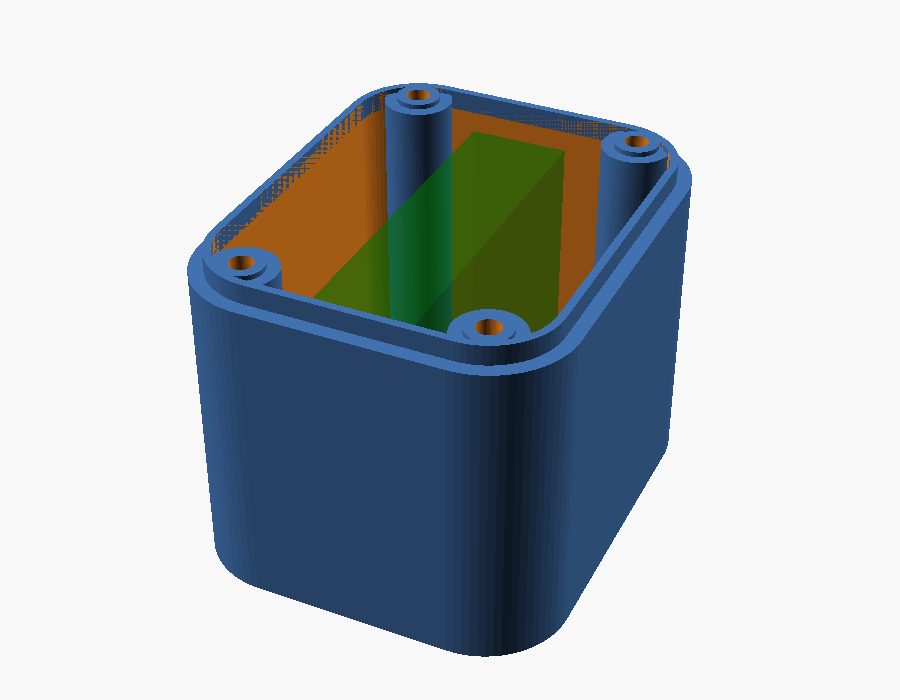

# Deep back plate — ESP32-S3-Touch-AMOLED-1.8

> **Status:** Living · **Last verified:** 2026-09-22

A 3D-printable replacement for the stock back cover of the
[Waveshare ESP32-S3-Touch-AMOLED-1.8](https://www.waveshare.com/esp32-s3-touch-amoled-1.8.htm)
([wiki](https://www.waveshare.com/wiki/ESP32-S3-Touch-AMOLED-1.8),
[sample code](https://github.com/waveshareteam/ESP32-S3-Touch-AMOLED-1.8)) — the panel that
runs the room-endpoint pet firmware in [`../../firmware/`](../../firmware/README.md).

The stock cover leaves almost no room behind the board: Waveshare's largest recommended cell
for the stock case is 3.85 × 24 × 28 mm. This plate is deeper and has a pocket sized to a real
LiPo (the sample export is for an 802525, 8 × 25 × 25 mm, about twice that volume), plugged
into the board's MX1.25 `BAT` connector. With that cell the unit goes from 15.0 mm thick to
about 22.7 mm. Everything else about the case stays
stock: all ports, buttons and the mic are in the **front** shell, so this part is solid except
for the battery pocket and four screw holes.

## Files

| File | What it is |
|---|---|
| `amoled18_back_plate.scad` | The parametric model. Every dimension is adjustable. |
| `back_plate_802525_400mAh.stl` | Ready-made export with the defaults below and an 802525 cell. |
| `preview.png` | Render with the battery ghosted in. |
| `photos/` | The real unit: the stock cover's inside, the assembled back, the board in the front shell. |
| `reference/` | Waveshare's dimension drawing, 3D model and schematic, plus the script that measured them. See [`reference/README.md`](reference/README.md). |

## Step by step, if you've never used OpenSCAD

OpenSCAD is a free CAD program where the shape is described by numbers rather than drawn by
hand. The upside is that you never have to model anything: you change a number in a form
("battery thickness = 8.6"), and the whole part redraws itself to fit. This file was written
that way on purpose, so **you should never need to touch the code** — only the form.

The `.stl` in this folder is built from the defaults in [Where the numbers come
from](#where-the-numbers-come-from). The outline and screw holes come from Waveshare's own
drawings; the rim and depth are estimates. Print it as a first test, then use the steps below
to adjust anything that doesn't fit.

### 1. Get the files

On the GitHub page for this folder, click `amoled18_back_plate.scad`, then the **download**
button (the down-arrow icon, top right of the file view). You only need the `.scad` file; the
`.stl` is just a pre-made example.

### 2. Install OpenSCAD

Download it free from [openscad.org](https://openscad.org/downloads.html) (Windows, Mac,
Linux) and install it like any other program.

### 3. Open the file and find the form

1. Open OpenSCAD, choose **Open**, and pick `amoled18_back_plate.scad`.
2. The window has three parts: the **code** on the left (ignore it), the **3D view** in the
   middle, and — after the next step — the **Customizer** form on the right.
3. If there is no form, go to **Window → Customizer** (on some versions, **View → Hide
   customizer** is ticked — untick it).
4. Press **F5**. The plate appears in the 3D view. Drag to spin it, scroll to zoom.

The form has numbered groups — click a group name to expand it. Each field has a plain-English
label, and most are sliders or drop-downs, so you can't enter something wildly wrong.

### 4. Check the numbers against the stock cover

The outline and screw positions come from Waveshare's own drawings, so they should already be
right. The **rim** and **depth** values are estimates from photos. Before a print you intend to
keep, measure the original black back cover and fix anything that's off. Digital calipers are
ideal; a good ruler works for a first try. All values are in millimetres.

| Form group | Field | What to measure on the stock cover |
|---|---|---|
| 2. Plate outline | `plate_x`, `plate_y` | Overall outside width and height |
| 2. Plate outline | `plate_r` | Roughly how round the outer corners are (radius) |
| 3. Rim | `lip_outer_x`, `lip_outer_y` | Outside width and height of the raised rim that slides into the front shell |
| 3. Rim | `lip_h` | How tall that rim stands |
| 3. Rim | `stock_clear` | Inside depth of the stock cover, rim top down to the floor |
| 4. Screws | `screw_dx`, `screw_dy` | Distance from the **centre** of the plate to the centre of a screw hole, across and up. Easiest: measure hole-to-hole and halve it. |

### 5. Enter the battery you actually have

In **group 1 (Battery)** type the cell's thickness, width and length — they're usually on the
cell's label or listing (an "802525" cell is 8.0 × 25 × 25 mm; allow a little extra for
swelling on thickness). Set `tape_t` and `foam_t` to the thickness of the tape and foam you'll
use. The pocket sizes itself from these automatically.

### 6. Check the console for warnings

Press **F5** again after changing values. At the bottom of the window is the **console**
(if it's hidden: **Window → Console**). It prints a summary block, and the last line should
say **`All checks passed.`** If instead it says something like `POCKET OVERLAPS A SCREW HOLE`,
the battery is too big for this plate — pick a smaller cell or adjust the flagged value.

Write down the **`SCREWS:`** line — it tells you how much longer your screws need to be than
the stock ones (see [Screws](#screws)).

### 7. Export the file for the printer

1. Press **F6** to do the full render. This can take a minute; wait until the progress bar
   finishes and the console says it's done.
2. Press **F7** (or **File → Export → Export as STL**) and save it.

F5 is just a quick preview; export only works after F6.

### 8. Slice and print

Open the exported `.stl` in your usual slicer (Bambu Studio, PrusaSlicer, Cura, …) and use the
settings in [Printing](#printing) below: flat face down, rim up, no supports.

**Do a test print first.** Print one quickly and hold it against the front shell to check the
rim slides in and the four holes line up with the brass inserts. If something is off, measure
again, change the number, and re-export — that's the whole point of the parametric file.

### 9. Save your numbers

The form remembers your values only while the file is open. To keep them, use the **preset**
bar at the top of the Customizer: click **+**, name it (e.g. `my 802525`), and it's saved
alongside the `.scad` file.

## Where the numbers come from

Sources: Waveshare's [dimension drawing](https://docs.waveshare.com/ESP32-S3-Touch-AMOLED-1.8)
and [3D model](https://files.waveshare.com/wiki/ESP32-S3-Touch-AMOLED-1.8/ESP32-S3-Touch-AMOLED-1.8-3D.zip)
(from the [resources page](https://docs.waveshare.com/ESP32-S3-Touch-AMOLED-1.8/Resources-And-Documents)),
and the photos in `photos/`. Copies of Waveshare's files are in [`reference/`](reference/README.md),
with `reference/measure.py` to re-derive the numbers. The 3D model has the board and display
but not the case shells.

| Default | Value | Source | Confidence |
|---|---|---|---|
| `plate_x` × `plate_y` | 37.6 × 45.2 | Case outline, dimension drawing | High (official) |
| `screw_dx`, `screw_dy` | 12.0, 18.0 (24 × 36 apart) | PCB mounting holes in the 3D model. The drawing and all three photos agree to within ~0.7 mm. | High |
| `plate_r` | 8.7 | Circle fitted to the case corners in the dimension drawing | Good, ±0.5 |
| `lip_outer_x` × `lip_outer_y`, `lip_outer_r` | 35.0 × 42.6, 7.4 | Outline minus a ~1.3 mm front-shell wall, estimated from the photos. (The board itself is 33.0 × 40.6.) | Estimate: **measure** |
| `stock_clear` | 3.9 | The stock cover shows 3.5 mm on the side view; depth derived from that and the rim height | Estimate: **measure** |
| `lip_h` | 2.0 | Not visible in any source | Guess: **measure** |
| `screw_size` | M2 | Screw heads measure ~3.8 mm across in the drawing, which matches M2 | Likely: check a stock screw |

For reference, the whole stock unit is 15.0 mm thick, and the back label window is
27.6 × 27.6 mm with R1.8 corners.

## Screws

Deepening the plate means the stock screws no longer reach the brass inserts in the board. The
OpenSCAD console prints exactly how much longer they must be (`SCREWS: M2, … mm longer than
stock`). Measure a stock screw's length, add that number, and buy M2 screws that long
(round up to the next size sold).

## Battery mounting

The cell sits on double-sided VHB tape on the pocket floor with foam padding above it — no
clip. Set `tape_t` and `foam_t` to what you actually have; both add to the required depth.

## Printing

| Setting | Value |
|---|---|
| Orientation | Flat face down, rim up. No supports. |
| Layer | 0.2 mm |
| Perimeters | 3 or more (the screw columns take the load) |
| Infill | 40 %+ |
| Material | PETG or ABS — PLA softens in a warm car. |

## Safety

These go to kids. Never pinch or compress a lithium pouch cell — keep the clearance the model
allows. Don't install a cell that is puffed, dented or damaged, and don't leave one charging
unattended.

## Photos

| Stock cover, inside | Assembled back | Board in the front shell |
|---|---|---|
|  |  |  |
