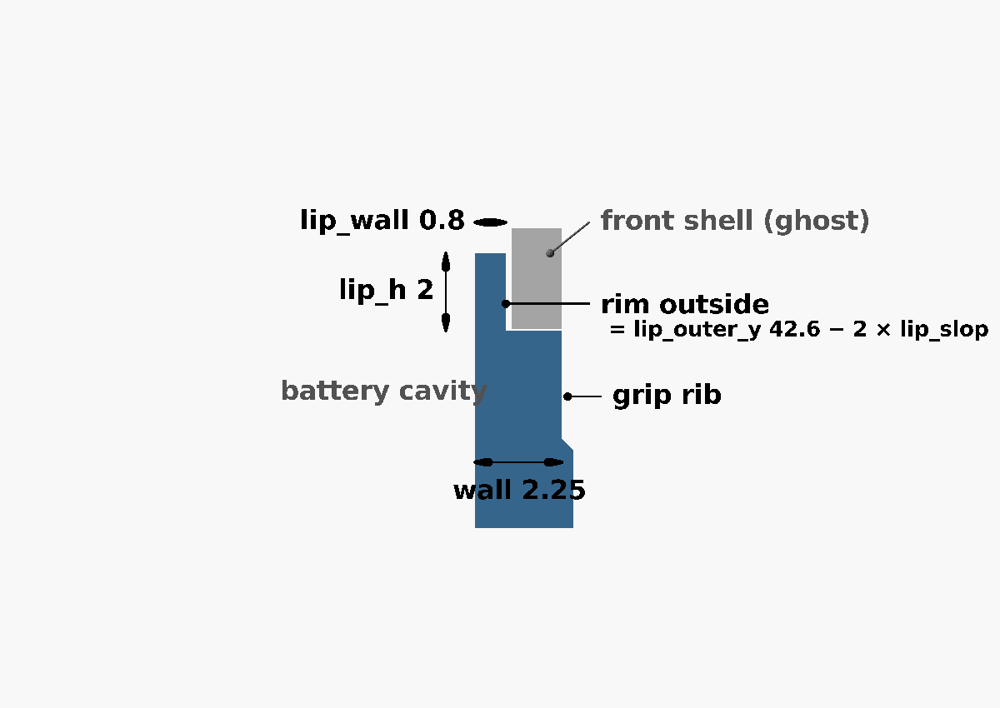
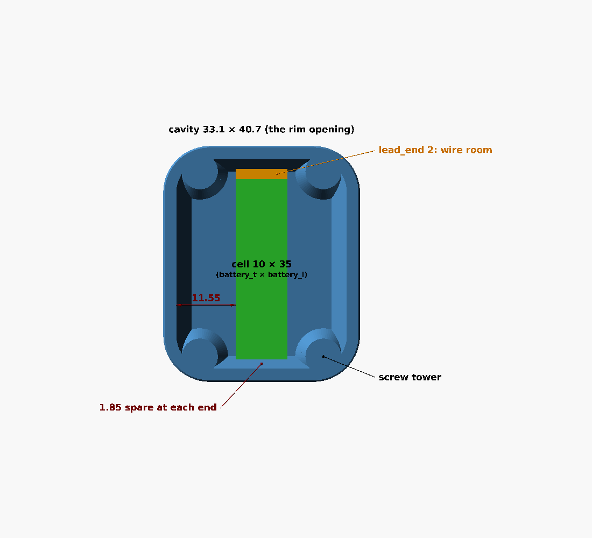
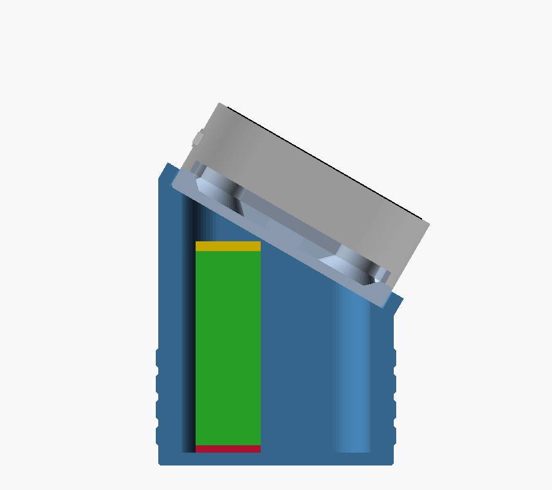

# Troubleshooting

> **Status:** Living · **Last verified:** 2026-09-23

Something came out wrong? Find it below. Each fix names the field to change in OpenSCAD —
[MODEL_ADJUSTMENT.md](MODEL_ADJUSTMENT.md) shows how to open the model, change a field and export.
Back to the [README](README.md).

**First, always:** open the `.scad`, pick your version from the Customizer's drop-down, press
**F5** and read the console. It lists every clearance the model worked out.

## Fitting the case

| Problem | Likely cause | Fix |
|---|---|---|
| **Rim won't go into the front shell** | Rim a little big | Raise `lip_slop` by 0.1; or measure the stock rim and lower `lip_outer_x` / `lip_outer_y` |
| **Plate wobbles or rattles on the shell** | Rim a little small | Lower `lip_slop` by 0.1 (not below 0); or raise `lip_outer_x` / `lip_outer_y` |
| **Rim sits proud, won't go all the way in** | Rim too tall | Measure the stock rim and lower `lip_h` |
| **Holes don't line up with the brass nuts** | Screw spacing | Measure hole to hole on the stock cover and set `screw_dx` / `screw_dy` to half of each ([outline figure](renders/fig-outline.png)) |

## Screws and towers

| Problem | Likely cause | Fix |
|---|---|---|
| **Screw won't go down the tower**, or the hex key jams | Thin top layer not cleared, or the bore printed small | Push the layer through with a 2 mm drill; if the bore itself is tight, raise `hole_slop` by 0.1 |
| **Gap at the seam when the screws are tight**, or the board feels pushed forward | Towers too tall | Measure the gap and raise `tower_drop` by that much |
| **Board rattles, or tightening pulls it backwards** | Towers too short to reach the nuts | Lower `tower_drop` by the gap (it can go negative) |
| **Screw spins without gripping** | Screw too short | Next length up, staying under the [limit](DESIGN.md#screws) |
| **Screw feels like it hits something, or the display looks pressed** | Screw too long | **Stop.** Use a shorter screw — the tip is reaching the display |

## Battery

| Problem | Likely cause | Fix |
|---|---|---|
| **Console says `CELL DOES NOT FIT`** | Cell too big for this orientation | Try another `battery_orientation` (edge, flat, end), or a smaller cell |
| **Battery won't go in** | Cell bigger than its listing, or wires in the way | Measure the cell including its folded circuit board, enter it, re-export; raise `lead_end` for wire room |
| **Battery slides around** | Too much space | More foam — that's what it's for |
| **Foam or battery pressing on the board** | Not enough headroom | Thinner foam, or raise `lead_space` by 1–2 mm |
| **Nothing happens when connected** | Plug reversed | Unplug at once and check polarity against the board's `+`/`−` marks ([PRINTING.md](PRINTING.md#5-fit-the-battery)) |

## Hole plugs

| Problem | Likely cause | Fix |
|---|---|---|
| **Plugs fall out** | Your printer makes holes big | Raise `plug_interference` by 0.05, set `part` = plugs, export again |
| **Plugs won't go in** | Your printer makes holes small | Lower `plug_interference` by 0.05 |
| **Plug won't sit flush** | Stringing in the recess | Clean the recess with a knife; or lower `plug_cap_t` a touch |

## Print quality

| Problem | Likely cause | Fix |
|---|---|---|
| **Back edge flares out at the bottom** (elephant's foot) | First layer squashed | Raise `edge_chamfer` to 0.6, or lower the bed temperature |
| **Corners lift off the bed** | Warping | Add a brim; clean the bed; PETG on a textured or glue-sticked bed |
| **Rim prints thin or broken** | Slicer drew one line instead of two | Enable thin-wall detection ("Arachne") in the slicer; or raise `lip_wall` to 1.0 (costs 0.4 mm of battery room) |
| **Rough spot at the top of each screw hole** | The bridged layer sagged a little | Normal; it's cleared anyway in assembly |
| **Ribs too strong or too subtle** | Taste | `grip_depth` 0.2–0.5, or 0 for smooth ([comparison](MODEL_ADJUSTMENT.md#grip-ribs)) |
| **Unit too thick** | Battery choice | Use the flat 802525 version (24.7 mm) |

## Desk stand

| Problem | Likely cause | Fix |
|---|---|---|
| **Console says `CELL DOES NOT FIT THE BOX`** | Cell too wide for the box, or its corners reach the rounded corners | Another `battery_orientation`; or lower `stand_ledge` a little |
| **Head won't drop into the pocket** | Pocket printed small | Raise `pocket_clear` by 0.1 and print the box again |
| **Head rattles in the pocket** | Pocket printed big | Lower `pocket_clear` by 0.1; or rely on the end screws |
| **Head sits proud, rocking on the battery** | Foam too thick, or the cell is bigger than entered | Thinner foam; measure the cell and enter it, which makes the box taller |
| **Lock screw won't bite** | Its hole in the head is too big | A longer screw (M2 × 8), or a drop of glue in the hole |
| **Lock screw won't go in** | Its hole in the head is too small | Open it with a 1.5 mm drill |
| **Battery plug won't reach the `BAT` socket** | Short wires | Tape the cell to the box's other end, nearer the slot; or extend the wires |
| **USB-C plug or buttons blocked** | Head in the wrong way round | The USB-C side goes to the box's tall back, where the pocket is open |
| **Too steep or too flat** | Taste | `stand_angle`, 10–45° |
